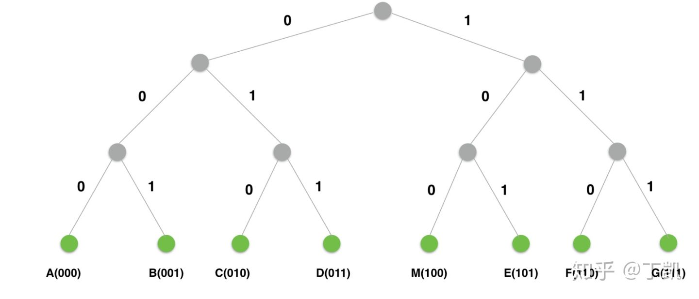
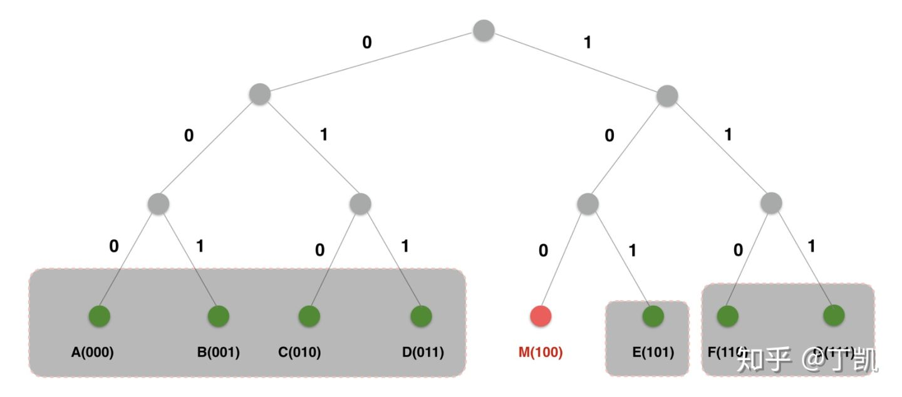
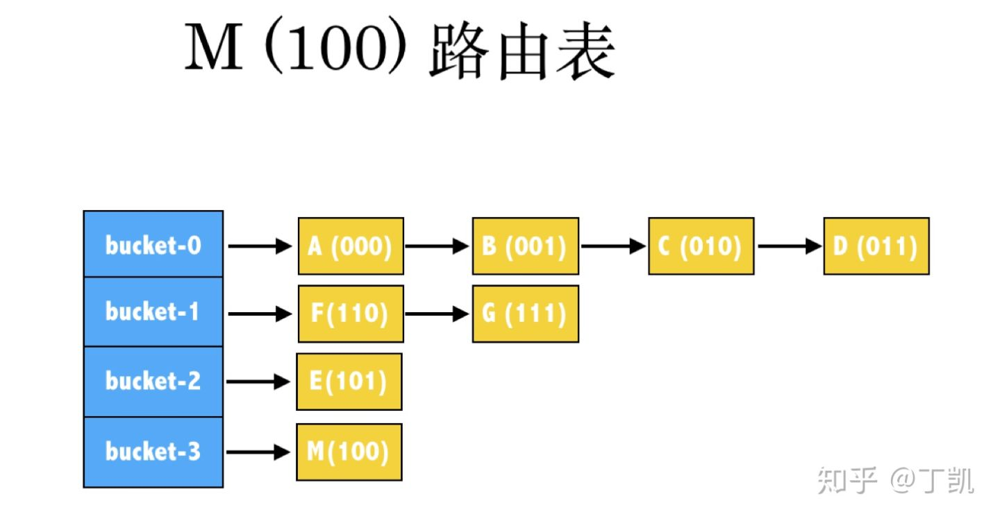
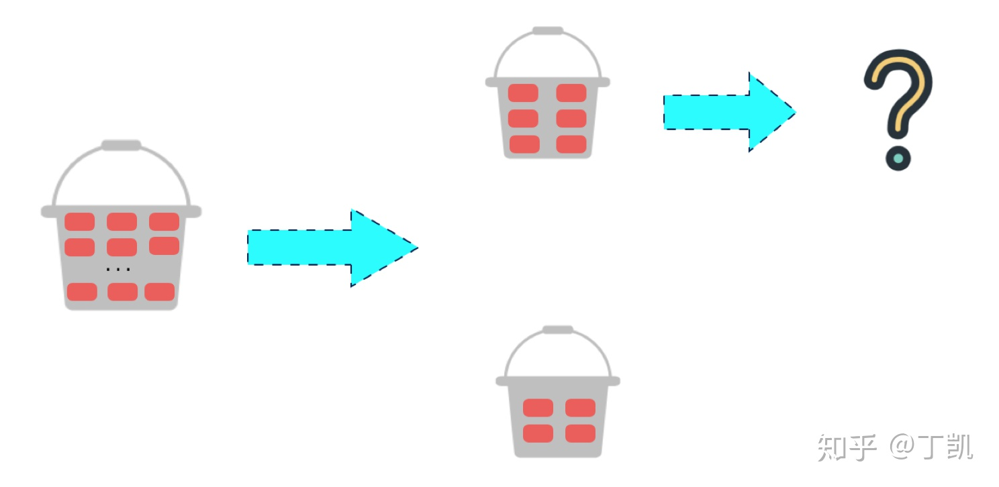
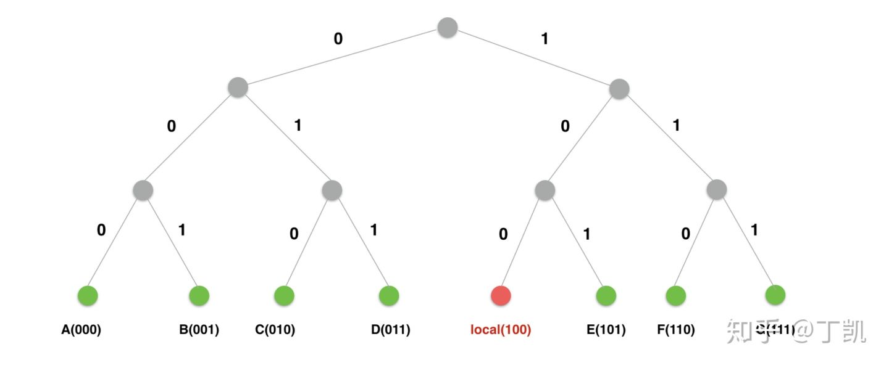
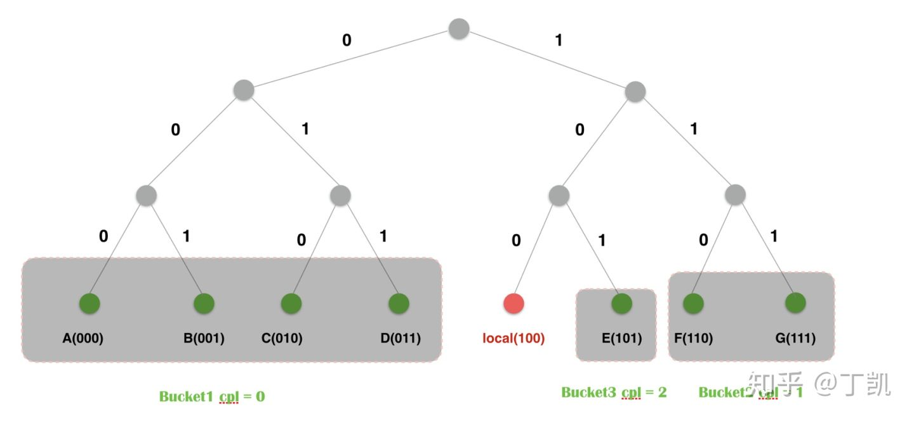
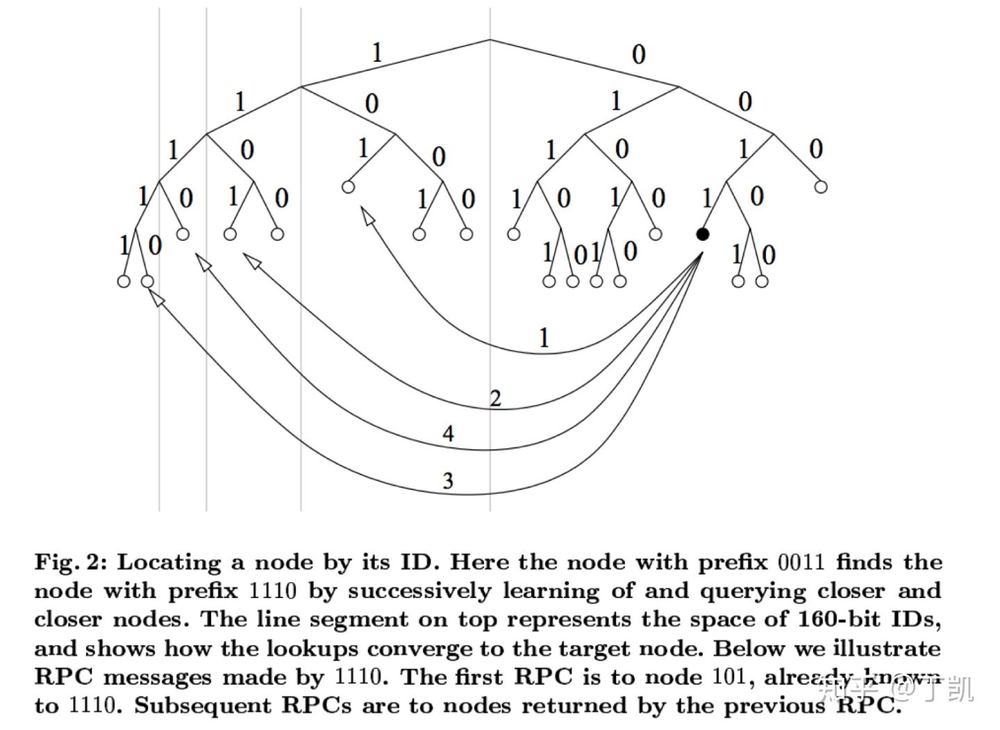
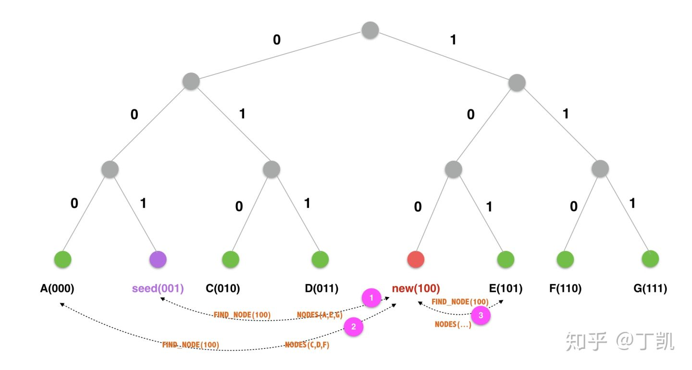

### Kademlia协议

#### 背景

Kademlia是美国纽约大学的 P. Maymounkov 和 D. Mazieres 在2002年发布的一项研究结果。Kademlia是一种分布式哈希表（DHT），是第三代对等网络的节点动态管理和路由协议。

与前两代协议如 Chord、CAN、Pastry 等相比，Kad以全局唯一id标记对等网络节点，以节点ID异或（XOR）值度量节点之间距离，并通过距离分割子树构建路由表，建立了一种全新的网络拓扑结构。相比于其他算法，更简单，更高效。

研究Kademlia是因为最近一段时间在关注IPFS，一个对等网络下的全球存储系统，其内部便是使用了该协议管理网络节点，进行对象存取。

#### 问题提出

使用一个对等网络(P2P Network)构建分布式存储系统，需要解决以下几个关键问题：

> 如何构建一致的网络拓扑？
>
> 如何快速查找特定网络节点（节点路由技术）？
>
> 如何处理网络中节点动态变化？
>
> 如何构建存储对象与节点之间的映射关系？
>
> 如何处理节点动态变化时的对象可靠性和可用性？

带着这些问题，我们一步步揭开Kademlia协议的神秘面纱。

#### 构建网络拓扑

Kad网络中的每个节点都会被分配唯一的节点ID，一般是160bit的二进制数。节点之间可以计算距离，节点距离以节点ID的XOR值度量:

> ![[公式]](https://www.zhihu.com/equation?tex=Dis%28M%2C+N%29+%3D+XOR%28M%2C+N%29)

因此，节点之间的距离越近，意味着节点ID的公共前缀越长。节点之间的距离以节点的最长公共前缀(cpl)为度量，cpl越大，表示两个节点越接近，例如节点 ![[公式]](https://www.zhihu.com/equation?tex=A%3D%28000100%29%2C+B%3D%28000011%29%EF%BC%8CDis%28A%2CB%29%3Dcpl%28A%2CB%29%3D3) ，。

基于此，一个完整的网络空间可以被表示成为一颗如下图所示的二叉树，树的叶子节点代表网络节点，下图演示了使用3bit作为节点ID位数的节点树结构。



从网络中每个节点的视角来看，它可以根据公共前缀长度将这颗二叉树分解为一系列不包含自己的子树。顶层的子树，由整棵不包含自己的树的另一半组成，即与节点之间的公共前缀长度为0；下一层子树由剩下部分不包含自己的一半组成，即公共前缀长度为1；依此类推，直到分割完整棵树。下图展示了从节点 ![[公式]](https://www.zhihu.com/equation?tex=M) 视角来分割上面的网络树的结果：



节点<A, B, C, D>与M的公共前缀长度为0，将其归为一个单元，节点<F, G>与M的公共前缀长度为1，将其归为单元2，节点<E>与M的公共前缀长度为2，将其归为单元3，按照前面的定义，公共前缀长度即为节点间的距离，因此，通过与M的距离，可以将网络中的节点分为以下4组：

> ![[公式]](https://www.zhihu.com/equation?tex=Dis%3D0%3A+%5C%7BA%2C+B%2C+C%2C+D%5C%7D) 
> ![[公式]](https://www.zhihu.com/equation?tex=Dis+%3D+1%3A+%5C%7BF%2C+G%5C%7D)
> ![[公式]](https://www.zhihu.com/equation?tex=Dis+%3D+2%3A+%5C%7BE%5C%7D)
> ![[公式]](https://www.zhihu.com/equation?tex=Dis+%3D+3%3A+%5C%7BE%5C%7D)

需要说明的是：距离越长，代表节点之间越接近，千万不要弄反了。而且可以总结发现，从任一节点来看，与其距离为0的节点占据网络节点总数的1/2，距离为1的节点占据网络节点总数的1/4，以此类推。

#### 构建路由表

构建路由表的本质是建立到网络全局的地图，目标是：对于节点 ![[公式]](https://www.zhihu.com/equation?tex=M) ，给定任意节点 ![[公式]](https://www.zhihu.com/equation?tex=X) ，可以根据节点很容易计算出距离 ![[公式]](https://www.zhihu.com/equation?tex=X) 更近的节点列表。虽然我们的目标是本地一步到位的查找，但这是不现实的，这需要维护数量巨大的全局节点信息。我们退而求其次，采用迭代查找的思路：每次查找要距离目标更近一点点。

除此以外，节点路由表还必须是动态更新的，以反映网络拓扑的变化。在接下来我们进一步阐述背后的设计思想。

**基本**

假如当前节点ID为 ![[公式]](https://www.zhihu.com/equation?tex=M) ， ![[公式]](https://www.zhihu.com/equation?tex=X) 距离 ![[公式]](https://www.zhihu.com/equation?tex=M) 上维护的节点 ![[公式]](https://www.zhihu.com/equation?tex=Y) 的距离为：

>  ![[公式]](https://www.zhihu.com/equation?tex=Dis%28X%2C+Y%29+%3D+Dis%28X%2C+M%29+%5Coplus+Dis%28M%2C+Y%29)

其中： ![[公式]](https://www.zhihu.com/equation?tex=Dis%28A%2C+B%29+%3D+A+%5Coplus+B+)

这个证明也很简单：

>  ![[公式]](https://www.zhihu.com/equation?tex=Dis%28X%2CY%29+%3D+X+%5Coplus+Y)
> ![[公式]](https://www.zhihu.com/equation?tex=Dis%28X%2C+M%29+%5Coplus+Dis%28M%2C+Y%29+%3D+X+%5Coplus+M+%5Coplus+M+%5Coplus+Y+%3D+X+%5Coplus+0+%5Coplus+Y+%3D+X+%5Coplus+Y)

于是：上面的问题就转化为：

当 ![[公式]](https://www.zhihu.com/equation?tex=M) 收到询问距离 ![[公式]](https://www.zhihu.com/equation?tex=X) 更近的节点请求时， ![[公式]](https://www.zhihu.com/equation?tex=M) 首先计算自身距离目标节点的距离 ![[公式]](https://www.zhihu.com/equation?tex=Dis%28X%2C+M%29+%3D+d1) ，然后再从自己维护的节点列表中选择出距离 ![[公式]](https://www.zhihu.com/equation?tex=M) 为 ![[公式]](https://www.zhihu.com/equation?tex=d1) 的所有节点（翻译一下：即从 ![[公式]](https://www.zhihu.com/equation?tex=M) 的路由表中找到与有最长公共前缀的所有节点）。

在前面的网络拓扑中我们知道，Kademlia协议中，每个节点按照与自己的距离来切割节点网络树：被切割的子树称之为 ![[公式]](https://www.zhihu.com/equation?tex=Bucket) 。整个路由表本质上便是一个 ![[公式]](https://www.zhihu.com/equation?tex=Bucket) 数组，Kademlia协议以聚类网络节点：每个 ![[公式]](https://www.zhihu.com/equation?tex=Bucket) 中的节点必然与本节点具有相同的最长公共前缀。

由于节点只有160bit，最长公共前缀长度最大只有160，因此，路由表中的 ![[公式]](https://www.zhihu.com/equation?tex=Bucket) 数量最多也就160。但是每个 ![[公式]](https://www.zhihu.com/equation?tex=Bucket) 内节点数量可能会非常多，根据之前的计算，与节点最长公共前缀长度为0的内节点数占据网络总节点数量的1/2，内节点数占网络总节点数的1/4...

Kademlia协议对每个 ![[公式]](https://www.zhihu.com/equation?tex=Bucket) 内维护的节点数设置了一个上限，称之为 ![[公式]](https://www.zhihu.com/equation?tex=K) 值，在一般的实现中 ![[公式]](https://www.zhihu.com/equation?tex=K%3D20) 。一旦 ![[公式]](https://www.zhihu.com/equation?tex=Bucket) 内节点数超过，便根据一定的淘汰算法进行更新。

根据该基本原理，节点构建的路由表如下图所示：



**分裂**

在一些实现Kademlia协议实现中，每个节点初始时只有一个 ![[公式]](https://www.zhihu.com/equation?tex=Bucket) ，感知到网络上有节点时，直接将远程节点信息添加至该，直到该内节点数量超过，此时开始分裂 ![[公式]](https://www.zhihu.com/equation?tex=Bucket) 。

所谓的分裂是指创建一个新的 ![[公式]](https://www.zhihu.com/equation?tex=Bucket) ，然后将原来 ![[公式]](https://www.zhihu.com/equation?tex=Bucket) 内的部分节点迁移至新 ![[公式]](https://www.zhihu.com/equation?tex=Bucket) 。因为原 ![[公式]](https://www.zhihu.com/equation?tex=Bucket) 内的节点与本节点的距离不尽相同，所以，迁移的原则是：将与本地节点更近(即更大)节点迁移至新建 ![[公式]](https://www.zhihu.com/equation?tex=Bucket) ，迁移完成后再判断新建 ![[公式]](https://www.zhihu.com/equation?tex=Bucket) 内节点数是否超过限制，如果是，继续对该新建 ![[公式]](https://www.zhihu.com/equation?tex=Bucket) 进行分裂。



上面提到迁移的过程中会将部分节点迁移至新 ![[公式]](https://www.zhihu.com/equation?tex=Bucket) ，那么如何选择这些需要被迁移的节点呢？答案是根据内节点与本节点之间的cpl决定：

> 需要分裂的都是存放与本节点之间的最大的节点所存在的（即存放与当前节点最近的节点），插入逻辑决定了该内的节点与本节点之间的距离不尽相同，但均有一个特点： ![[公式]](https://www.zhihu.com/equation?tex=cpl+%3E%3D+len%28Buckets%29) 。

初始状态时，本地只有1个，此时分裂的目标是：

```text
newBucket := bucket.Split(len(rt.Buckets)-1, rt.local)
```

参数1的含义是参考 ![[公式]](https://www.zhihu.com/equation?tex=cpl) ，即将 ![[公式]](https://www.zhihu.com/equation?tex=Bucket) 中与 ![[公式]](https://www.zhihu.com/equation?tex=rt.local) 的 ![[公式]](https://www.zhihu.com/equation?tex=cpl) 超过 ![[公式]](https://www.zhihu.com/equation?tex=len%28rt.Buckets%29-1%3D0) 的节点都迁移至新的 ![[公式]](https://www.zhihu.com/equation?tex=Bucket) 。 ![[公式]](https://www.zhihu.com/equation?tex=cpl) 为0即距离当前节点最远的那部分节点（没有任何公共前缀），翻译成人话就是：在原 ![[公式]](https://www.zhihu.com/equation?tex=Bucket) 中保留与本节点为0（无任何公共前缀的节点），将其他节点迁移至新 ![[公式]](https://www.zhihu.com/equation?tex=Bucket) 中。

一次分裂后，第一个 ![[公式]](https://www.zhihu.com/equation?tex=Bucket) 中保留的全部是与当前节点无任何公共前缀的节点，第二个 ![[公式]](https://www.zhihu.com/equation?tex=Bucket) 中保留的全部是与当前节点公共前缀大于等于1的节点。

接下来判断第二个 ![[公式]](https://www.zhihu.com/equation?tex=Bucket) 是否需要再次分裂，如果分裂，再次创建新 ![[公式]](https://www.zhihu.com/equation?tex=Bucket) ，然后将第二个 ![[公式]](https://www.zhihu.com/equation?tex=Bucket) 中与本地节点公共前缀超过1的节点迁移至新 ![[公式]](https://www.zhihu.com/equation?tex=Bucket) ，与本地节点公共前缀长度为1的节点依然保留在第二个 ![[公式]](https://www.zhihu.com/equation?tex=Bucket) 中。

下图直观地演示分裂过程，假设演示中 ![[公式]](https://www.zhihu.com/equation?tex=Bucket) 内的节点数最大 ![[公式]](https://www.zhihu.com/equation?tex=K) 为1，而不是20。



假设本地节点为 ![[公式]](https://www.zhihu.com/equation?tex=Local%28100%29) ，初始时所有其他节点都位于一个 ![[公式]](https://www.zhihu.com/equation?tex=Bucket) 内，共包含7个节点。

**第一次分裂**

创建一个新的，将原中与local的cpl超过0的节点迁移至新的 ![[公式]](https://www.zhihu.com/equation?tex=Bucket) 。于是，此时两个 ![[公式]](https://www.zhihu.com/equation?tex=Bucket) 内的内容变为：

> ![[公式]](https://www.zhihu.com/equation?tex=Bucket_%7Bold%7D+%3D+%5C%7BA%2C+B%2C+C%2C+D%5C%7D)
> ![[公式]](https://www.zhihu.com/equation?tex=Bucket_%7Bnew%7D+%3D+%5C%7BE%2C+F%2C+G%5C%7D)

接下来再次分裂，将其中与local的cpl超过1的节点迁移至新的 ![[公式]](https://www.zhihu.com/equation?tex=Bucket) ，于是，现在就变为：

> ![[公式]](https://www.zhihu.com/equation?tex=Bucket_%7Bnew%7D+%3D+%5C%7BF%2C+G%5C%7D)
> ![[公式]](https://www.zhihu.com/equation?tex=Bucket_%7Bnew1%7D+%3D+%5C%7BE%5C%7D)

形成了如下的分区：



#### 路由算法

路由算法要解决的是如何根据目标ID找到地址或者找到与该ID最节点的目标节点地址。

在一个对等网络中，某个节点要查询其他节点的信息时，它可依赖的信息只有两个：

> 目标节点ID；
> 当前节点维护的路由表；

其查询的核心思想是：**逐步迭代，递近查找**。其基本过程如下：

1. 发起者首先计算自身( ![[公式]](https://www.zhihu.com/equation?tex=L) )与目标节点( ![[公式]](https://www.zhihu.com/equation?tex=T) )的距离，即 ![[公式]](https://www.zhihu.com/equation?tex=cpl) ，查询本地维护的路由表，计算方法是 ![[公式]](https://www.zhihu.com/equation?tex=Bucket+%3D+local.Buckets%5Bcpl%5D) ，这个 ![[公式]](https://www.zhihu.com/equation?tex=Bucket) 中的节点与目标节点有着公共前缀。然后再从该 ![[公式]](https://www.zhihu.com/equation?tex=Bucket) 中选择与目标节点有最长 ![[公式]](https://www.zhihu.com/equation?tex=cpl+) 的节点，接下来本地节点向发起查询请求( ![[公式]](https://www.zhihu.com/equation?tex=QueryPeers) )，因为距离 ![[公式]](https://www.zhihu.com/equation?tex=T) 更近，相当于第一次缩短了与目标节点 ![[公式]](https://www.zhihu.com/equation?tex=T) 的距离；
2.  ![[公式]](https://www.zhihu.com/equation?tex=X) 收到 ![[公式]](https://www.zhihu.com/equation?tex=L) 发起的对目标节点 ![[公式]](https://www.zhihu.com/equation?tex=T) 的定位消息(*Message_FIND_NODE*)时，会根据自身维护的路由表信息，返回距离 ![[公式]](https://www.zhihu.com/equation?tex=T) 更近的节点供查询发起者继续查询。当然，如果目标节点就是自身，那直接返回自身信息即可。需要说明的是：给返回的响应并非是距离目标节点最近的那一个节点，而是一批节点（即协议中定义的值 ![[公式]](https://www.zhihu.com/equation?tex=K) ）。这样做有几点好处：1). 避免单个节点不可用导致的查询失败；2). 查询发起者可以根据响应结果进行并发查询，提升查询速度。
3. 查询发起者 ![[公式]](https://www.zhihu.com/equation?tex=L) 收到响应后，会将被这些作为接下来的查询对象继续进行查询。查询收到响应时，会对响应中的结果进行过滤：如果该节点在之前已经被询问过，便不再加入待查询列表，保证查询的收敛性。

查询的最终结果是得到了一批距离目标节点很近的节点列表，然后从节点列表中选择出最接近目标的个节点。选择这个节点的目的是可用来读，也可用来写对象，具体见后面描述。

下图摘自原始论文，基本描述了查询流程。



#### 路由表更新

Kademlia网络中节点是动态变化的，节点可新接入网络，也可从网络离线。这也意味着每个节点的路由表也是一直变化着的。

**新节点上线**

新节点 ![[公式]](https://www.zhihu.com/equation?tex=N) 上线时，需要为其提供一个种子节点 ![[公式]](https://www.zhihu.com/equation?tex=S) ，以 ![[公式]](https://www.zhihu.com/equation?tex=S) 作为中介加入Kademlia网络，具体来说：

1. 将 ![[公式]](https://www.zhihu.com/equation?tex=S) 加入本地路由表，成为 ![[公式]](https://www.zhihu.com/equation?tex=N) 的种子节点；
2. 向 ![[公式]](https://www.zhihu.com/equation?tex=S) 发起一次节点查询请求(FIND_NODE)，查询的目的节点其实是自身；该请求的目的有二：第一告诉 ![[公式]](https://www.zhihu.com/equation?tex=S) 新增了节点 ![[公式]](https://www.zhihu.com/equation?tex=N) ，第二通过 ![[公式]](https://www.zhihu.com/equation?tex=S) 发现集群中更多的节点。而发起了指向自身的查询请求也很有意思：其一是因为 ![[公式]](https://www.zhihu.com/equation?tex=N) 此时还不知道系统更多的节点信息；其二是通过这种方式 ![[公式]](https://www.zhihu.com/equation?tex=N) 可以快速地找到更多距离自己更接近的节点。
3.  ![[公式]](https://www.zhihu.com/equation?tex=S) 收到 ![[公式]](https://www.zhihu.com/equation?tex=N) 的查询目标节点请求，首先将节点 ![[公式]](https://www.zhihu.com/equation?tex=N) 加入自身的路由表中，然后给 ![[公式]](https://www.zhihu.com/equation?tex=N) 最多返回 ![[公式]](https://www.zhihu.com/equation?tex=K) 个距离 ![[公式]](https://www.zhihu.com/equation?tex=N) 更接近的节点信息；
4.  ![[公式]](https://www.zhihu.com/equation?tex=N) 收到 ![[公式]](https://www.zhihu.com/equation?tex=S) 的响应，将响应中的节点加入自身路由表，然后对这些节点分别发起查询请求，当然，查询的目标还是自身。



通过上面的重复步骤，新增节点逐步建立起对网络节点的理解，而且，通过该机制可以了解到，新增节点会更多地发现距离自己更接近的节点信息。

**节点离线**

节点离线在Kademlia协议中无需做特殊处理，如果某个节点离线，那么其离线事件最终会反馈到网络节点的路由表中，将其从路由表中剔除即可，相比于Chord协议有了极大的简化。

#### 用Kademlia网络存储对象

使用Kademlia网络构建大规模分布式存储系统，需要解决以下两个核心问题：

> 建立对象与网络节点之间的映射
>
> 节点动态变化时保证对象的可访问

**对象与节点映射**

建立对象与节点的映射，一般有两种方法：

> 查表：维护全局<对象，节点>映射表
>
> 计算：直接根据对象特征，通过数学运算得到目标节点

方法1需要维护庞大的全局映射表，且其很明显会成为系统瓶颈，且违背了对等网络的原则。

方法2必须将对象映射至节点空间，即将对象根据其唯一特征计算160bit的指纹，根据该指纹找到网络中与其指纹最接近的个节点，这些节点将成为对象的最终存储目的地。一般这个指纹会选取对象内容的hash，便于对象去重和对象的唯一性保证。而之所以选择个节点存储对象是为了提高对象数据的可靠性。

**对象Re-Publishing**

在P2P网络中，节点是动态变化的，而结合我们刚刚描述的对象节点映射算法，可能会导致以下几个问题:

- 对象<key, value>被存储在与key距离最接近的 ![[公式]](https://www.zhihu.com/equation?tex=K) 个节点，如果 ![[公式]](https://www.zhihu.com/equation?tex=K) 个节点全部离线，那么对象便不可达；
- 对象<key, value>被存储在与key距离最接近的 ![[公式]](https://www.zhihu.com/equation?tex=K) 个节点，如果网络新加入节点 ![[公式]](https://www.zhihu.com/equation?tex=N) 且 ![[公式]](https://www.zhihu.com/equation?tex=N) 距离key更接近，对象也需要进行一次迁移，因为下次去查找的时候，会直接定位到 ![[公式]](https://www.zhihu.com/equation?tex=N) ，如果数据不迁移至 ![[公式]](https://www.zhihu.com/equation?tex=N) ，那对象虽然数据存在，但也是不可达。

解决上面的问题有以下两种思路：

- Pull：如果新增一个节点 ![[公式]](https://www.zhihu.com/equation?tex=N) ，且距离某对象 ![[公式]](https://www.zhihu.com/equation?tex=O) 更为接近，此时某节点访问对象内容，根据算法很可能被定位至节点 ![[公式]](https://www.zhihu.com/equation?tex=N) 上，此时再去当前所在的节点上Pull数据返回给对象访问者；
- Push：如果新增一个节点 ![[公式]](https://www.zhihu.com/equation?tex=N) ，且距离某对象 ![[公式]](https://www.zhihu.com/equation?tex=O) 的更为接近，一旦对象所在的节点探测到 ![[公式]](https://www.zhihu.com/equation?tex=N) 的存在，会主动地将数据推至 ![[公式]](https://www.zhihu.com/equation?tex=N) ，这也可以保证下次访问时无需中转而直接获取到数据。

对比两种方案:

> 方案1中，新增节点需要了解对象此时所在节点位置，这是做不到的，可以根据自身路由表计算出当前距离最接近的节点，但是没法知道前一个时刻距离最接近的节点；而且该方案没法处理节点批量离线导致的对象不可访问问题。
>
> 方案2看起来是可行的，探测到新节点加入，然后计算本地存储的对象中有哪些距离更为接近，将这些接近的对象push至此。当然，这种做法也无法时刻都在做，因为在大量节点的P2P网络中，节点变更是常态，一种比较合理的方式是定期做检查。但是该方案依赖于能够感知到新增的存在，好在，需要迁移对象的一定是距离很接近的节点。在我们前面新增节点流程描述中可以知道一个新增节点上线时，算法会偏向于将该新增节点通知到距离其更近的节点中。因此，一旦一个新节点上线，那么距离其接近的节点就会更快地了解到该节点信息，从而将其本地存储的数据可以push至新增节点。

通过对比可确认方案二才是切实可行的，而且符合P2P网络的松耦合的设计。但是该方案也并非完美：一旦有新增节点可能就会带来大量的数据拷贝，消耗大量资源。万事万物总是这样，在收获好处的同时总得付出代价。

在论文中，作者提出了按照小时为单位执行Re-Publishing：每个小时，每个节点对本地存储的每一个对象进行Re-Publishing。每一次Re-Publishing包括下面两个步骤:

1. 首先查询当前最近的K个节点信息；
2. 节点向1中获得的节点发送数据存储消息，从而完成数据更新

针对每个节点的每个对象都执行类似操作，会导致P2P网络出现突激的网络流量。仔细分析上面的行为，我们可以发现，其实很多的Re-Publishing是无用的：

> 如果在一个小时的周期内，网络拓扑没有发生变化，那根本不需要进行Re-Publishing；
>
> 对于不同的节点、，如果对象在节点、上均已存储，那其实在一个Re-Publishing周期内，只需要一个节点(或者)来更新即可，没必要大家同时一起上，浪费资源；
>
> 步骤1中的K-Closest查询是否有必要：因为根据上面的表述，对于新增节点，其实是可以很快速地反映到最近节点路由表，所以一般情况下，查询本地节点路由表即可。

针对上面的疑问，论文中也提出了几点优化方案：

- 避免不必要的Re-Publishing：首先，如果对象刚被写入（Re-Publishing周期内写入的），那么认为该对象其实是被写到最新的网络拓扑节点中，那就不对该对象做Re-Publishing；
- 关于多节点同时Re-Publishing相同对象问题，可以这么解：将不同节点的Re-Publishing设置不一样（如在一个范围内随机取值），这样，例如节点 Re-Publishing了对象，节点再次Re-Publishing对象时便发现其最后修改时间是刚刚，根据上面的描述，节点就不再Re-Publishing了，存储的其他节点同样如此，有效避免了一个周期内多节点同时Re-Publishing问题；
- 关于避免节点更新问题，大家自行参考论文吧，懒得看了。

#### 参考

https://pdos.csail.mit.edu/~petar/papers/maymounkov-kademlia-lncs.pdfpdos.csail.mit.edu

https://github.com/libp2p/go-libp2p-kad-dhtgithub.com