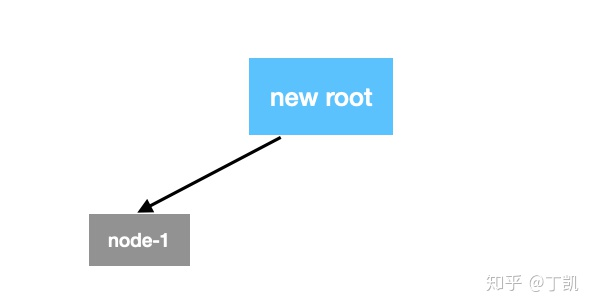
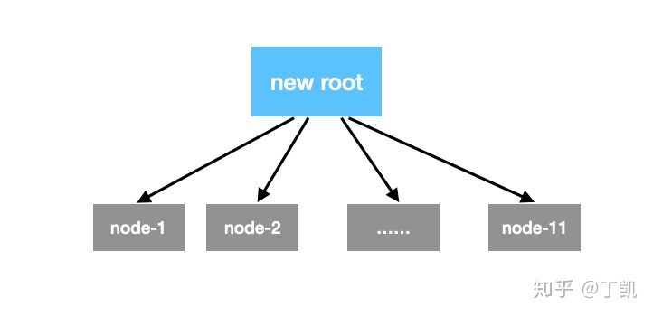
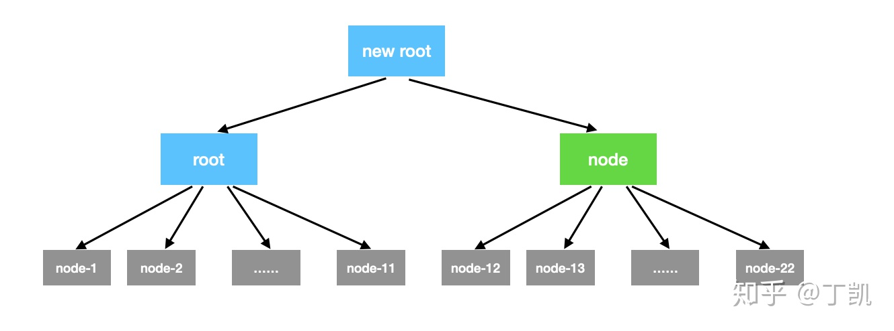

### Balanced-Merkle-Tree实现

#### 概述

以下内容来自Wikipedia，仅做科普。

哈希树（hash tree；Merkle tree），在密码学及计算机科学中是一种树形数据结构，每个叶节点均以数据块的哈希作为标签，而除了叶节点以外的节点则以其子节点标签的加密哈希作为标签 。哈希树能够高效、安全地验证大型数据结构的内容，是哈希链的推广形式。

哈希树的概念由瑞夫·墨克于 1979 年申请专利，故亦称墨克树（Merkle tree）。

而Balanced Merkle Tree是所有Block数据只存储在叶子节点，且所有叶子节点到根距离相等的一种Merkle Tree。IPFS存储会将文件切割为Block并将这些Block构建为一棵Merkle Tree存储。IPFS实现了两种Merkle Tree：Balanced Merkle Tree和Trickle Merkle Tree，本文只描述Balanced Merkle Tree的内部实现。

#### 实现

```go
func Layout(db *h.DagBuilderHelper) (ipld.Node, error) {
    /* 如果没有数据,返回一个空节点, nil代表输入数据 */
    if db.Done() {
        root, err := db.NewLeafNode(nil, ft.TFile)
        return root, db.Add(root)
    }

    /* 构建第一个根节点, 该根节点也包含data */
    root, fileSize, err := db.NewLeafDataNode(ft.TFile)

    /* 如果只需要一个block，那么直接返回root即可 */
    /* 否则，从depth开始构建 Merkle Tree,下面会详细描述该过程 */
    for depth := 1; !db.Done(); depth++ {
        newRoot := db.NewFSNodeOverDag(ft.TFile)
        newRoot.AddChild(root, fileSize, db)
        root, fileSize, err = fillNodeRec(db, newRoot, depth)
    }
    return root, db.Add(root)
}
```

其主要逻辑是：从depth 1开始构建每个深度上的节点，主要实现在于函数*fillNodeRec*：

```go
func fillNodeRec(db *h.DagBuilderHelper, node *h.FSNodeOverDag, depth int) (filledNode ipld.Node, nodeFileSize uint64, err error) {
    if node == nil {
        node = db.NewFSNodeOverDag(ft.TFile)
    }
    var childNode ipld.Node
    var childFileSize uint64

    for node.NumChildren() < db.Maxlinks() && !db.Done() {
        if depth == 1 {
            // Base case: add leaf node with data.
            childNode, childFileSize, err = db.NewLeafDataNode(ft.TFile)
        } else {
            childNode, childFileSize, err = fillNodeRec(db, nil, depth-1)
        }
        err = node.AddChild(childNode, childFileSize, db)
    }

    nodeFileSize = node.FileSize()
    filledNode, err = node.Commit()
    return filledNode, nodeFileSize, nil
}
```

该函数的实现比较简短但也很有意思，首先我们理解下输入参数，重点关注node和depth：

> node: 要为该节点创建子节点，
> depth：当前node所处的depth，从1开始

每个node的孩子节点数量由db.Maxlinks()控制，默认是11。我们从初始时只有一个root节点开始分析，此时depth为1，如果我们的文件大小只够创建一个节点，那么Layout()中的for循环便不会进入，直接返回该root。

否则，说明该文件至少要创建2个节点，此时便需要为其创建一个new root，同时将第一个root作为其子节点并调用*fillNodeRec*来为new root添加更多子节点。此时depth为1，此时该Tree的拓扑图如下：



接下来，在*fillNodeRec*函数中，会为该new root创建更多子节点直到文件被切割完成或者new root的子节点达到上限，我们不考虑文件切割完成这种情况，形成的拓扑结构如下：



由于该new root被填满，返回至Layout，如果此时文件未被切割完，我们需要提升depth至2来继续构建，此时树的高度提升，因此需要构建一个新的new root，原来的new root变成了root也随之成为new root的子节点，形成如下拓扑：



带着该拓扑我们再次进入*fillNodeRec*，只是此时depth变为2：

```go
func fillNodeRec(db *h.DagBuilderHelper, node *h.FSNodeOverDag, depth int) (filledNode ipld.Node, nodeFileSize uint64, err error) {
    for node.NumChildren() < db.Maxlinks() && !db.Done() {
        if depth == 1 {
            ...
        } else {
            childNode, childFileSize, err = fillNodeRec(db, nil, depth-1)
        }
        err = node.AddChild(childNode, childFileSize, db)
    }
```

在这里我们看到由于depth != 1，因此进入else分支，在该分支内递归调用自身，但传入的node为nil且depth变为1，这里的目的在于为上面的new root创建一棵子树，让我们不妨进入递归调用内部：

```go
func fillNodeRec(db *h.DagBuilderHelper, node *h.FSNodeOverDag, depth int) (filledNode ipld.Node, nodeFileSize uint64, err error) {
    if node == nil {
        node = db.NewFSNodeOverDag(ft.TFile)
    }
    for node.NumChildren() < db.Maxlinks() && !db.Done() {
        if depth == 1 {
            ...
        } else {
            childNode, childFileSize, err = fillNodeRec(db, nil, depth-1)
        }
        err = node.AddChild(childNode, childFileSize, db)
    }
}
```

由于传入参数中node为nil，depth为1，此时会创建一个新的node并且为该新node构建db.Maxlinks()个子节点，最后返回该node，此时退出递归，返回的node被作为前面new root的子节点加入该Merkle Tree中，形成如下拓扑：


图中青色节点代表递归中新创建的子节点。而由于new root的子节点数量未到限制，因此该过程会继续，直到new root被填满，然后返回Layout，继续提升depth创建更上一级new root，原来的new root变成root成为其子节点。该过程我们便不再重复，感兴趣的读者可以自行模拟。另外，ipfs有个网站 [https://dag.ipfs.io/](https://link.zhihu.com/?target=https%3A//dag.ipfs.io/) 也以动画的方式展示了Merkle Tree是如何构建的，感兴趣的读者也可以参考这里。