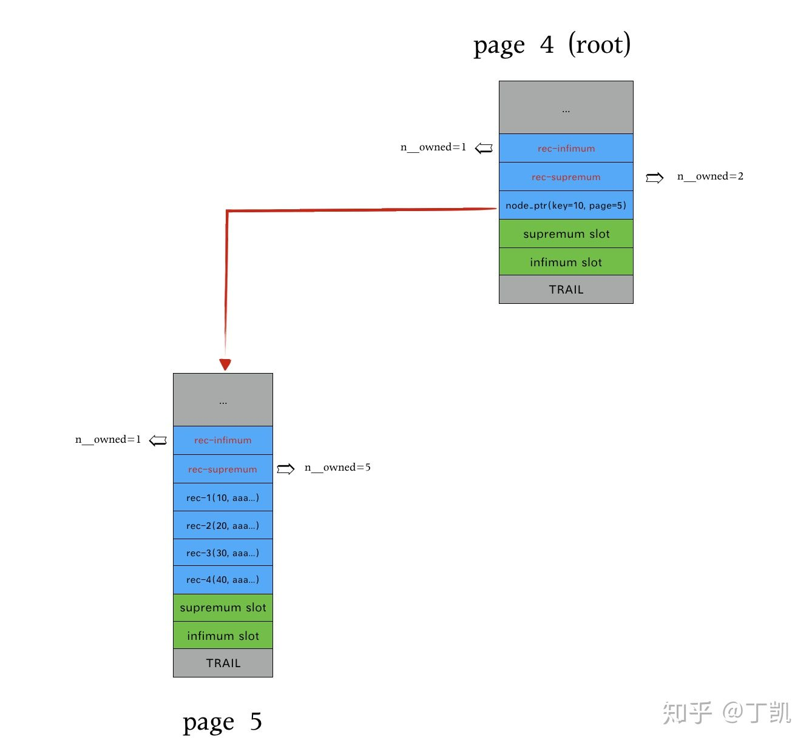
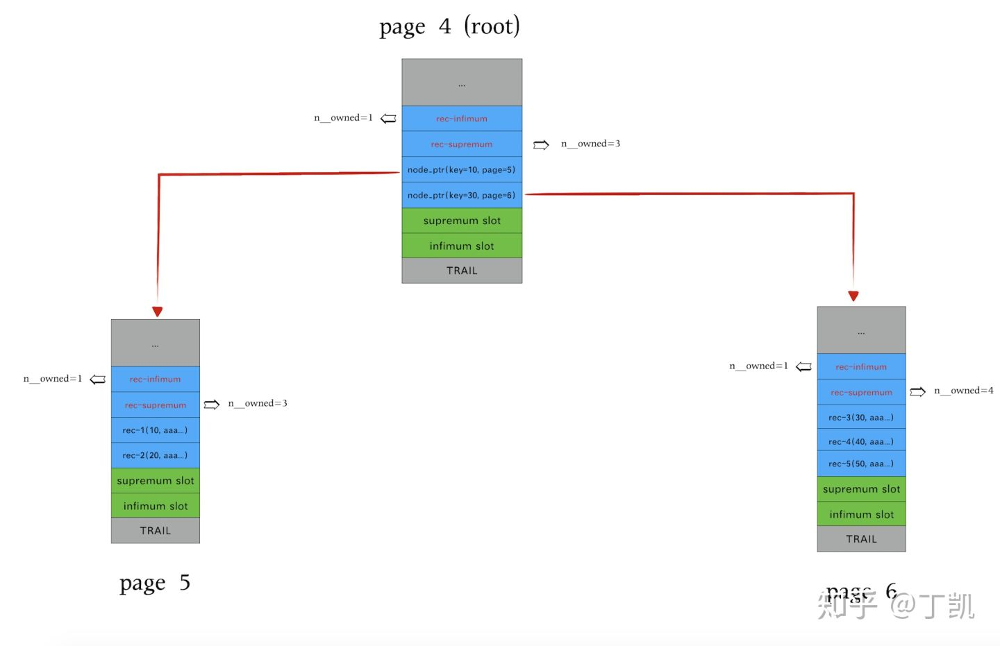

### INNODB页面分裂

#### 何时进行页面分裂

插入操作时首先调用乐观插入函数*btr_cur_optimistic_insert*，若发现此次空间不足，进行悲观插入，函数*btr_cur_pessimistic_insert*，在这里会触发页面分裂。

```cpp
dberr_t btr_cur_optimistic_insert(...) {
  ...
  if (leaf && page_size.is_compressed() &&
      (page_get_data_size(page) + rec_size >=
       dict_index_zip_pad_optimal_page_size(index)))
  {
    ...
  fail:
    err = DB_FAIL;
    // 接下来要进入page split,提前发起对兄弟页面的预取
    // 这样split的时候兄弟页面很可能已经在buffer内了,提升split性能
    if (page_is_leaf(page)) {
      btr_cur_prefetch_siblings(block);
    }

  fail_err:
    ...
    return (err);
  }
  ulint max_size = page_get_max_insert_size_after_reorganize(page, 1);

  // 如果page内空间不足,此时需要split,跳转进入fail,返回DB_FAIL
  if (page_has_garbage(page)) {
    if ((max_size < rec_size || max_size < BTR_CUR_PAGE_REORGANIZE_LIMIT) &&
        page_get_n_recs(page) > 1 &&
        page_get_max_insert_size(page, 1) < rec_size) {
      goto fail;
    }
  } else if (max_size < rec_size) {
    goto fail;
  }
}

dberr_t row_ins_clust_index_entry_low()
{
  ...
  if (mode != BTR_MODIFY_TREE) {
    ...
  } else {
    ...
    // 先执行乐观插入,如果返回DB_FAIL,则执行悲观插入
    // 悲观插入涉及到页面分裂
    err = btr_cur_optimistic_insert(flags, cursor, &offsets, &offsets_heap,
                                    entry, &insert_rec, &big_rec, n_ext, thr,
                                    &mtr);
    if (err == DB_FAIL) {
      err = btr_cur_pessimistic_insert(flags, cursor, &offsets, &offsets_heap,
                                       entry, &insert_rec, &big_rec, n_ext,
                                       thr, &mtr);
}
```

悲观插入因为涉及到页面分裂，逻辑较为复杂，我们尝试尽量将其简单化描述：

```cpp
dberr_t btr_cur_pessimistic_insert(...)
{
    ...
    // 首先预留空间以保证本次split操作成功
    // 至于预留多少,没有搞清楚
    if (!(flags & BTR_NO_UNDO_LOG_FLAG) || index->table->is_intrinsic()) {
    ulint n_extents = cursor->tree_height / 16 + 3;
    ...
    success = fsp_reserve_free_extents(&n_reserved, index->space, n_extents,
                                       FSP_NORMAL, mtr);
    if (!success) {
      return (DB_OUT_OF_FILE_SPACE);
    }
  }
  
  // 如果是需要分裂的leaf page是root page
  if (dict_index_get_page(index) ==
      btr_cur_get_block(cursor)->page.id.page_no())
  {
    *rec = btr_root_raise_and_insert(flags, cursor, offsets, heap, entry, n_ext,
                                     mtr);
  } else {
    // 普通页面分裂
    *rec = btr_page_split_and_insert(flags, cursor, offsets, heap, entry, n_ext,
                                     mtr);
  }
}
```

我们先来看如何分裂root page。

#### root页面分裂

root page分裂的过程是：申请一个新page，将root的记录，转移到新page中；重建旧root并将其作为新的root；然后对新page进行节点分裂，新root变为索引节点，其中插入记录指向新page。而新page的分裂则是走下面描述的普通页面分裂流程。

```cpp
rec_t *btr_root_raise_and_insert(...)
{
  ...
  // 创建新page, 其B-Tree层高等于root page的层高
  level = btr_page_get_level(root, mtr);
  new_block = btr_page_alloc(index, 0, FSP_NO_DIR, level, mtr, mtr);
  new_page = buf_block_get_frame(new_block);
  new_page_zip = buf_block_get_page_zip(new_block);
  btr_page_create(new_block, new_page_zip, index, level, mtr);
  btr_page_set_next(new_page, new_page_zip, FIL_NULL, mtr);
  btr_page_set_prev(new_page, new_page_zip, FIL_NULL, mtr);

  // 从root page中拷贝所有记录至新创建page,代码省略
  page_zip_copy_recs(new_page_zip, new_page, root_page_zip, root, index, mtr);
  ...

  // 新page已经拷贝了原root page的所有行记录
  // rec指向新page的非infimum的第一个行记录
  // 后面构建的索引记录其实就是该rec
  rec = page_rec_get_next(page_get_infimum_rec(new_page));

  // 构建索引记录指向新page
  // 索引记录是一个tuple对象,其中除记录rec的索引外,还有新page的page_no
  // 该记录指向新page的第一个非infimum行记录
  new_page_no = new_block->page.id.page_no();
  if (dict_index_is_spatial(index)) {
    ...
  } else {
    node_ptr = dict_index_build_node_ptr(index, rec, new_page_no, *heap, level);
  }
  ...
  // 现在,root page可以被清空并插入上面创建的索引记录以指向其孩子页面
  btr_page_empty(root_block, root_page_zip, index, level + 1, mtr);
  btr_page_set_next(root, root_page_zip, FIL_NULL, mtr);
  btr_page_set_prev(root, root_page_zip, FIL_NULL, mtr);

  page_cursor = btr_cur_get_page_cur(cursor);

  page_cur_set_before_first(root_block, page_cursor);

  // 插入至新的root page
  node_ptr_rec = page_cur_tuple_insert(page_cursor, node_ptr, index, offsets,
                                       heap, 0, mtr);
  ...
  // 在新page中定位到待插入的tuple位置,记录在page_cursor
  page_cur_search(new_block, index, tuple, page_cursor);

  // 接下来在新page中开始分裂并插入目标记录
  // 走普通页面分裂流程,在下面详细描述
  if (dict_index_is_spatial(index)) {
    ...
  } else {
    return (btr_page_split_and_insert(flags, cursor, offsets, heap, tuple,
                                      n_ext, mtr));
  }
}
```

举例说明，假如表结构还是如之前创建的那样：

```sql
mysql> CREATE TABLE t (
    -> a INT NOT NULL PRIMARY KEY,
    -> b VARCHAR(3500)
    -> ) ENGINE=INNODB CHARSET=LATIN1 ROW_FORMAT=COMPACT;
```

可以知道该表页面最多可插入4条记录，再插入第五条时page便会产生分裂，假如

```sql
mysql> INSERT INTO t SELECT 10,REPEAT('a',3500);
mysql> INSERT INTO t SELECT 20,REPEAT('a',3500);
mysql> INSERT INTO t SELECT 30,REPEAT('a',3500);
mysql> INSERT INTO t SELECT 40,REPEAT('a',3500);
```

使用分析工具看到此时只有一个root page，且其中有以下记录：

```text
************ FILE_PAGE_HEADER ****************
     0:   page_crc      : 0x38e917fe
     4:   page_no       : 4
     8:   page_version  : 4294967295
    12:   space_version : 4294967295
    16:   page_lsn      : 3363988429
    24:   page_type     : FIL_PAGE_INDEX
    26:   page_flush_lsn: 0
    34:   space_id      : 9
************ FILE_PAGE_HEADER ****************
    42:   page_format  : COMPACT
    38:   n_dir_slots  : 2
    40:   heap_top     : 14220
    42:   heap_number  : 0x8006
    44:   free         : 0
    46:   deleted_bytes: 0
    48:   last_insert  : 10703
    50:   direction    : PAGE_RIGHT
    52:   n_direction  : 3
    54:   n_records    : 4
    56:   max_trx_id   : 0
    64:   level        : 0
    66:   index_id     : 153
    74:   btr_seg_leaf : Space: 9, Page: 2, Offset: 626
    84:   btr_seg_top  : Space: 9, Page: 2, Offset: 434
    99:   records[   0]: n_owned: 1, heap_no:      0, rec_type: REC_INFIMUM, next_rec: 29
   128:   records[   1]: n_owned: 0, heap_no:     16, rec_type: REC_DATA, next_rec: 3525
  3653:   records[   2]: n_owned: 0, heap_no:     16, rec_type: REC_DATA, next_rec: 3525
  7178:   records[   3]: n_owned: 0, heap_no:     32, rec_type: REC_DATA, next_rec: 3525
 10703:   records[   4]: n_owned: 0, heap_no:     32, rec_type: REC_DATA, next_rec: 54945
   112:   records[   5]: n_owned: 5, heap_no:      1, rec_type: REC_SUPREMUM, next_rec: 0
 16372:   slots[   1]: 112
 16374:   slots[   0]: 99
```

假如此时插入第五条记录：

```sql
mysql> INSERT INTO t SELECT 50,REPEAT('a',3500);
```

此时会进入root页面分裂，创建一个新page，将root page中已有的行记录全部拷贝进去，然后构建一个指针记录，指向新page的第一条记录，然后将指针记录插入新root page，于是现在的结构如下图所示：



原本的root page no为4，分配了一个新的page 5来存储了4中所有记录并清空4，且在4中插入了一条指针记录，其key为10，page_no为5，指向page 5的第一条记录。

接下来只需要针对5做split就可以了，而这只是一次普通页面分裂。

#### 普通页面分裂

普通页面分裂的实现位于函数*btr_page_split_and_insert*，主要步骤如下：

1. 从要分裂的page 中, 找到要split 的record, split 的时候要保证split 的位置是record 的边界
2. 分配新的索引页
3. 分别计算page, 和new_page 的边界record
4. 在父节点添加新的索引页的索引项, 如果父节点空间不足， 触发父节点分裂操作
5. 连接当前索引页, 当前索引页prev_page, next_page, father_page, 新创建的 page. 当前的连接顺序是先连接父节点, 然后是prev_page/next_page, 最后是 page 和 new_page
6. 将当前索引页上的部分record 移动到新索引页
7. SMO 操作已经结束, 计算本次insert 要插入的page 位置
8. 进行insert 操作, 如果insert 失败, 通过reorgination page 重新尝试插入

```cpp
rec_t *btr_page_split_and_insert(...)
{
  insert_left = FALSE;
    
  // 这里有个优化:
  // 进行分裂时，如果定位的cursor是当前页的尾部，先试图向右兄弟页插入
  // 如果插入失败，再进行分裂,可减少分裂次数。
  rec = btr_insert_into_right_sibling(flags, cursor, offsets, *heap, tuple,
                                      n_ext, mtr);
  if (rec != NULL) {
    return (rec);
  }

  // 以下的复杂逻辑用来判断要page的split record位置,后面专门描述
  // 如果上面的两种情况都不满足
  //  1. 如果page中的用户行记录数大于1,那就取page的中间记录作为split_rec
  //  2. 否则:
  //     2.1 如果要插入的tuple小于page的第一个记录(其实也是唯一记录),那么从该唯一记录处开始split
  //     2.2 否则,split_rec设置为null
  if (n_iterations > 0) {
    ...
  } else if (btr_page_get_split_rec_to_right(cursor, &split_rec)) {
    direction = FSP_UP;
    hint_page_no = page_no + 1;
  } else if (btr_page_get_split_rec_to_left(cursor, &split_rec)) {
    direction = FSP_DOWN;
    hint_page_no = page_no - 1;
  } else {
    direction = FSP_UP;
    hint_page_no = page_no + 1;
    if (page_get_n_recs(page) > 1) {
      split_rec = page_get_middle_rec(page);
    } else if (btr_page_tuple_smaller(cursor, tuple, offsets, n_uniq, heap)) {
      split_rec = page_rec_get_next(page_get_infimum_rec(page));
    } else {
      split_rec = NULL;
    }
  }

  // 创建一个新索引page,以容纳老page的部分record
  new_block = btr_page_alloc(cursor->index, hint_page_no, direction,
                             btr_page_get_level(page, mtr), mtr, mtr);
  new_page = buf_block_get_frame(new_block);
  new_page_zip = buf_block_get_page_zip(new_block);
  btr_page_create(new_block, new_page_zip, cursor->index,
                  btr_page_get_level(page, mtr), mtr);

  // 以下主要计算first_rec和move_limit,以便于后面的move
  // 上面的所有都是为了计算这两个变量
  // 如果split_rec不为null,那么first_rec和move_limit都是split_rec
  if (split_rec) {
    first_rec = move_limit = split_rec;
    *offsets =
        rec_get_offsets(split_rec, cursor->index, *offsets, n_uniq, heap);

    insert_left = cmp_dtuple_rec(tuple, split_rec, cursor->index, *offsets) < 0;

    if (!insert_left && new_page_zip && n_iterations > 0) {
      split_rec = NULL;
      goto insert_empty;
    }
  } else if (insert_left) {
    first_rec = page_rec_get_next(page_get_infimum_rec(page));
    move_limit = page_rec_get_next(btr_cur_get_rec(cursor));
  } else {
insert_empty:
    buf = UT_NEW_ARRAY_NOKEY(
        byte, rec_get_converted_size(cursor->index, tuple, n_ext));
    first_rec = rec_convert_dtuple_to_rec(buf, cursor->index, tuple, n_ext);
    move_limit = page_rec_get_next(btr_cur_get_rec(cursor));
  }

  // 修改B-Tree:因为生成了一个新page,因而需要在父page中增加索引记录
  // 而这可能又会产生新的页面分裂
  btr_attach_half_pages(flags, cursor->index, block, first_rec, new_block,
                        direction, mtr);
  // 分裂原页面的行记录至两个页面
  // 分裂的原理:
  // 1. 首先将原页面的内容全部拷贝至新页面
  // 2. 删除原页面的部分用户行记录
  // 3. 删除新页面的部分用户行记录
  if (direction == FSP_DOWN) {
    ...
  } else {
    ...
  }

  // B-Tree结构修改和物理记录搬迁都已完成,接下来将目标记录插入至合适位置
  if (insert_left) {
    insert_block = left_block;
  } else {
    insert_block = right_block;
  }

  // 确定目标记录的插入位置并尝试插入,如果成功则退出,否则整理page然后重试
  page_cursor = btr_cur_get_page_cur(cursor);
  page_cur_search(insert_block, cursor->index, tuple, page_cursor);
  rec = page_cur_tuple_insert(page_cursor, tuple, cursor->index, offsets, heap,
                              n_ext, mtr);
  ...
}
```

仍然以上面的例子来说明，split前B-Tree结构如下：


第一步确定split_rec的位置，由于page 5是从老root page拷贝而来，但LAST_INSERT信息则是没有继承自原page，因而split_rec取的是mid_rec，为rec-3，因而也就确认了first_rec和move_limit也为rec-3。

第二步是创建新page，且page_no为6，并根据split_rec在父页面中为其创建一个新的指针记录，指向page 6的第一个记录rec-3。

第三步是真正的页面分裂，先将page 5的所有用户记录拷贝至page 6，而由于插入方向为FSP_UP，因而在page 6中就是删除rec-3以前的所有记录（不包括rec-3），而在page 5中则是删除rec-3以后的所有用户记录（包括rec-3）。

第四步便是将目标记录插入至特定页面，这里是插入至page 6，此时B-Tree结构如下：



#### split record计算

在前面普通页面分裂时会涉及到计算split record，即从该记录开始的所有行记录均会被移动至新页面。这部分逻辑牵涉面较多，特拎出来单独分析。

```cpp
rec_t *btr_page_split_and_insert(...)
{
  insert_left = FALSE;
  ...

  // 计算规则:
  
  // 如果insert_point位于PAGE_LAST_INSERT前(也即插入模式是顺序插入)
  //  1. 如果insert_point的下一个记录是supremum rec,那从该要插入的record处开始split
  //  2. 如果如果insert_point的下下一个记录是supremum rec,那同情况1
  //  3. 如果上述1/2都不成立,意味着insert point后至少有2条用户记录,从insert point的下下一条记录处开
  //     始分裂(为什么这么做?)
  // case-1:
  //  ----------------------------------------------------
  //  | infimum | rec-1 | ... | PAGE_LAST_INSERT | ..... | 
  //  ----------------------------------------------------
  //                          ^
  //                          | --------> split rec
  //                     insert point
  // case-2:
  //  -----------------------------------------
  //  | infimum | PAGE_LAST_INSERT | supremum |
  //  -----------------------------------------
  //            ^
  //            |--------> split rec
  //       insert point
  // case-3:
  //  ----------------------------------------------
  //  | infimum | rec-1 | PAGE_LAST_INSERT | ..... | 
  //  ----------------------------------------------
  //                    ^       ^
  //                    |       |--------> split rec
  //               insert point
  // 如果上面的两种情况都不满足
  //  1. 如果page中的用户行记录数大于1,那就取page的中间记录作为split_rec
  //  2. 否则:
  //     2.1 如果要插入的tuple小于page的第一个记录(其实也是唯一记录),那么从该唯一记录处开始split
  //     2.2 否则,split_rec设置为null
  if (n_iterations > 0) {
    ...
  } else if (btr_page_get_split_rec_to_right(cursor, &split_rec)) {
    direction = FSP_UP;
    hint_page_no = page_no + 1;
  } else if (btr_page_get_split_rec_to_left(cursor, &split_rec)) {
    direction = FSP_DOWN;
    hint_page_no = page_no - 1;
  } else {
    direction = FSP_UP;
    hint_page_no = page_no + 1;
    if (page_get_n_recs(page) > 1) {
      split_rec = page_get_middle_rec(page);
    } else if (btr_page_tuple_smaller(cursor, tuple, offsets, n_uniq, heap)) {
      split_rec = page_rec_get_next(page_get_infimum_rec(page));
    } else {
      split_rec = NULL;
    }
  }
```

这里情况比较多，我们一一探讨：

**btr_page_get_split_rec_to_right**

```cpp
// 这里返回TRUE表示将行记录向右分裂：即分配的新page的hint_page_no为原page+1
// 且将page内较大的行记录移动至该新page
ibool btr_page_get_split_rec_to_right(btr_cur_t *cursor, rec_t **split_rec)
{
  page_t *page = btr_cur_get_page(cursor);
  rec_t *insert_point = btr_cur_get_rec(cursor);

  // 如果insert_point位于PAGE_LAST_INSERT处(对应顺序插入模式),LAST_INSERT代表上次插入位置
  // insert_point代表小于等于待插入目标记录的最大记录位置
  // 如果insert_point=PAGE_LAST_INSERT意味着本次待插入的记录是紧接着上次已插入的记录,也就是
  // 这是一种顺序插入模式
  //  1. 如果insert_point的下一条记录是supremum rec,即PAGE_LAST_INSERT是本页面最后一个用户记录
  //     返回split_rec为nullptr。对于调用者,此时不会将任何记录移动至新page,而只在新page
  //     中插入目标record
  //  2. 如果如果insert_point的下下一条记录是supremum rec,会将下图case-2中的rec-next
  //     移动至新page,并将目标record插入至新page中
  //  3. 如果上述1/2都不成立,意味着insert_point后至少有2条用户记录,从insert point的下下一条记录处开
  //     始分裂,即在原page中保留PAGE_LAST_INSERT及其后面的一条记录(case-3中的rec-next),余下的记录  
  //     转移至新page,目标记录也插入原page
  // case-1:
  //  -------------------------------------
  //  | ... | PAGE_LAST_INSERT | supremum | 
  //  -------------------------------------
  //        ^
  //        |
  //   insert point
  // case-2:
  //  ------------------------------------------------
  //  | ... | PAGE_LAST_INSERT | rec-next | supremum |
  //  ------------------------------------------------
  //        ^
  //        |
  //   insert point
  // case-3:
  //  ----------------------------------------------------------------------
  //  | ... | PAGE_LAST_INSERT | rec-next | rec-next-next | ... | supremum |
  //  ----------------------------------------------------------------------
  //        ^                             |
  //        |                             |-------> split rec
  //   insert point
  //
  if (page_header_get_ptr(page, PAGE_LAST_INSERT) == insert_point) {
    rec_t *next_rec = page_rec_get_next(insert_point);
    if (page_rec_is_supremum(next_rec)) {
    split_at_new:
      *split_rec = NULL;
    } else {
      rec_t *next_next_rec = page_rec_get_next(next_rec);
      if (page_rec_is_supremum(next_next_rec)) {
        goto split_at_new;
      }
      *split_rec = next_next_rec;
    }
    return (TRUE);
  }
  return (FALSE);
}
```

上面的设计看起来比较复杂，但其背后的思想也比较好理解：

如果判定是顺序插入模式，便不会从中间开始分裂，而是从insert_point处开始分裂。这样可尽量保证左页面是满的而右页面很空，接下来的顺序插入肯定是插入新页面，相比于左页面和右页面平均分裂，这样可减少接下来的页面分裂次数，同时也不至于左页面内空间利用率不高。

**btr_page_get_split_rec_to_left**

```cpp
ibool btr_page_get_split_rec_to_left(btr_cur_t *cursor, rec_t **split_rec)
{
  page_t *page = btr_cur_get_page(cursor);
  rec_t *insert_point = btr_cur_get_rec(cursor);

  if (page_header_get_ptr(page, PAGE_LAST_INSERT) ==
      page_rec_get_next(insert_point)) {
    rec_t *infimum = page_get_infimum_rec(page);

    // 假如插入的记录为20
    // case-1:
    //  --------------------------------------
    //  | infimum | rec-30 | rec-40 | rec-50 |
    //  --------------------------------------
    //  ^         ^
    //  |         |---> LAST_INSERT
    //  insert point
    // 此时insert_point为infimum,其next为LAST_INSERT,判定为逆序插入
    // 此时无需分裂现有page的任何行记录,只要将记录20插入新页面即可
    //
    // case-2:
    //  --------------------------------------------------------
    //  | infimum | rec-10 | rec-15 | rec-30 | rec-40 | rec-50 |
    //  --------------------------------------------------------
    //                     ^        ^
    //                     |        |
    //               insert point  LAST_INSERT
    // 此时要将20插入rec-15和rec-30之间,于是将rec-10分裂至左页面,腾出的一个rec空间插入20
    // 由于是逆序插入,那么保证左页面比较空更容易减少后续的页面分裂概率
    // case-3:
    //  --------------------------------------------------------
    //  | infimum | rec-15 | rec-30 | rec-40 | rec-50 |
    //  --------------------------------------------------------
    //            ^        ^
    //            |        |
    //      insert point  LAST_INSERT
    // 此时要将20插入rec-15和rec-30之间,于是将rec-15分裂至左页面,腾出的一个rec空间插入20
    // 由于是逆序插入,那么保证左页面比较空更容易减少后续的页面分裂概率
    if (infimum != insert_point && page_rec_get_next(infimum) != insert_point) {
      *split_rec = insert_point;
    } else {
      *split_rec = page_rec_get_next(insert_point);
    }

    return (TRUE);
  }

  return (FALSE);
}
```

其背后的设计思想同上面一样，只是这次模式是逆序插入，我们尽量保证左页面为空，有利于降低接下来页面分裂的概率。