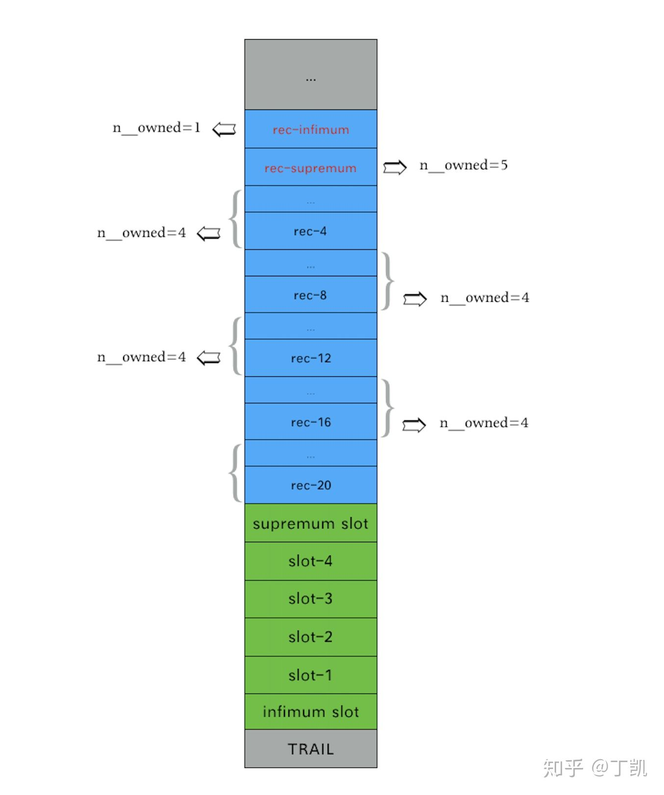

### **说明**

为了快速查找记录，Innodb在每个Page的行记录后定义了一个称之为目录槽（directory slot）的结构，用于快速定位页面中行记录。

dir slot中记录了行记录在页面内偏移。需要注意的是，目录槽和行记录并非一一对应的关系，每个dir slot最多可管理8个物理行记录。定位时首先是二分查找dir slot，再通过其中记录的偏移找到行记录，进而再进行顺序查找定位特定行。

### **dir slot的存储**

Innodb的index page存在两个特殊行记录：infimum record和supremum record，分别代表页面内记录的上下界，同样存在与之对应的infimum slot和supremum slot，记录了infimum 和supremum record起始位置。

dir slot占用两个字节，采用逆序存储，即infimum slot总是在INDEX PAGE body最后2个字节上，其他的依次类推。每个slot可以管理多个行纪录。以下是各种slot的记录数描述范围（n_owned）:


dir slot指向的record头部的n_owned字段记录的是前向有多少个行记录属于该slot管辖，中间被管辖的record的n_owned = 0。通过directory slot的二分查找可定位该记录所属的directory slot，接下来只需在被管辖的records进行顺序查找即可定位目标行记录。这种设计既减少了directory slot的空间占用，又能获得较好的查找效率。

初始化index page时，创建infimum和supremum record后，同样会为这两条系统行记录初始化相应的dir slot：

```cpp
static page_t *page_create_low(buf_block_t *block, ulint comp,
                               page_type_t page_type) {
  if (comp) {
    // 写入infimum和supremum两条记录，从page的PAGE_DATA偏移处
    memcpy(page + PAGE_DATA, infimum_supremum_compact,
           sizeof infimum_supremum_compact);
    // 初始化infimum和supremum两条记录的dir slot
    page[UNIV_PAGE_SIZE - PAGE_DIR - PAGE_DIR_SLOT_SIZE * 2 + 1] =
        PAGE_NEW_SUPREMUM;
    page[UNIV_PAGE_SIZE - PAGE_DIR - PAGE_DIR_SLOT_SIZE + 1] = PAGE_NEW_INFIMUM;
  }
  ...
}
```

每个dir slot占据2个字节，directory slots被存储在整个page rec body的后面，infimum dir slot位于页面的UNIV_PAGE_SIZE-8-2个字节处，supremum dir slot则位于页面的UNIV_PAGE_SIZE-8-4个字节处。

### **示例**

创建一张表并向其中插入了若干条用户记录，用工具分析root page当前的内容：

```text
************ FILE_PAGE_HEADER ****************
     0:   page_crc      : 0x7a4957e2
     4:   page_no       : 4
     8:   page_version  : 4294967295
    12:   space_version : 4294967295
    16:   page_lsn      : 1373190210
    24:   page_type     : FIL_PAGE_INDEX
    26:   page_flush_lsn: 0
    34:   space_id      : 6
************ FILE_PAGE_HEADER ****************
    42:   page_format  : COMPACT
    38:   n_dir_slots  : 6
    40:   heap_top     : 560
    42:   heap_number  : 0x8016
    44:   free         : 0
    46:   deleted_bytes: 0
    48:   last_insert  : 543
    50:   direction    : PAGE_NO_DIRECTION
    52:   n_direction  : 0
    54:   n_records    : 20
    56:   max_trx_id   : 0
    64:   level        : 0
    66:   index_id     : 150
    74:   btr_seg_leaf : Space: 6, Page: 2, Offset: 626
    84:   btr_seg_top  : Space: 6, Page: 2, Offset: 434
    99:   records[   0]: n_owned: 1, heap_no:      0, rec_type: REC_INFIMUM, next_rec: 26
   125:   records[   1]: n_owned: 0, heap_no:     16, rec_type: REC_DATA, next_rec: 22
   147:   records[   2]: n_owned: 0, heap_no:     16, rec_type: REC_DATA, next_rec: 22
   169:   records[   3]: n_owned: 0, heap_no:     32, rec_type: REC_DATA, next_rec: 22
   191:   records[   4]: n_owned: 4, heap_no:     32, rec_type: REC_DATA, next_rec: 22
   213:   records[   5]: n_owned: 0, heap_no:     48, rec_type: REC_DATA, next_rec: 22
   235:   records[   6]: n_owned: 0, heap_no:     48, rec_type: REC_DATA, next_rec: 22
   257:   records[   7]: n_owned: 0, heap_no:     64, rec_type: REC_DATA, next_rec: 22
   279:   records[   8]: n_owned: 4, heap_no:     64, rec_type: REC_DATA, next_rec: 22
   301:   records[   9]: n_owned: 0, heap_no:     80, rec_type: REC_DATA, next_rec: 22
   323:   records[  10]: n_owned: 0, heap_no:     80, rec_type: REC_DATA, next_rec: 22
   345:   records[  11]: n_owned: 0, heap_no:     96, rec_type: REC_DATA, next_rec: 22
   367:   records[  12]: n_owned: 4, heap_no:     96, rec_type: REC_DATA, next_rec: 22
   389:   records[  13]: n_owned: 0, heap_no:    112, rec_type: REC_DATA, next_rec: 22
   411:   records[  14]: n_owned: 0, heap_no:    112, rec_type: REC_DATA, next_rec: 22
   433:   records[  15]: n_owned: 0, heap_no:    128, rec_type: REC_DATA, next_rec: 22
   455:   records[  16]: n_owned: 4, heap_no:    128, rec_type: REC_DATA, next_rec: 22
   477:   records[  17]: n_owned: 0, heap_no:    144, rec_type: REC_DATA, next_rec: 22
   499:   records[  18]: n_owned: 0, heap_no:    144, rec_type: REC_DATA, next_rec: 44
   543:   records[  19]: n_owned: 0, heap_no:    160, rec_type: REC_DATA, next_rec: 65514
   521:   records[  20]: n_owned: 0, heap_no:    160, rec_type: REC_DATA, next_rec: 65127
   112:   records[  21]: n_owned: 5, heap_no:      1, rec_type: REC_SUPREMUM, next_rec: 0
 16364:   slots[   5]: 112
 16366:   slots[   4]: 455
 16368:   slots[   3]: 367
 16370:   slots[   2]: 279
 16372:   slots[   1]: 191
 16374:   slots[   0]: 99
```




图中的page共有6个directory slot：

- infimum slot仅管辖infimum record
- slot-1管辖rec1~rec4这四条行记录，且slot-1中记录rec-4的位置，rec-4的n_owned字段值为4
- slot-2管辖rec5~rec8这四条行记录，且slot-2中记录rec-8的位置，rec-8的n_owned字段值为4
- slot-3管辖rec9~rec12这四条行记录，且slot-3中记录rec-12的位置，rec-12的n_owned字段值为4
- slot-4管辖rec13~rec16这四条行记录，且slot-4中记录rec-16的位置，rec-16的n_owned字段值为4
- supremum slot管辖了rec-20~rec-17以及supremum rec这5个行记录，因而其头部的n_owned字段为5，supremum slot中记录了rec_supremum在page内的位置。

### **dir slot的分裂和聚合**

在page中插入新记录后会判断其所属slot管理的记录数是否超限，如果是，需要进行dir slot的分裂，一分为二：

```cpp
rec_t *page_cur_insert_rec_low(...)
{
    ...
    if (UNIV_UNLIKELY(n_owned == PAGE_DIR_SLOT_MAX_N_OWNED)) {
      page_dir_split_slot(page, NULL, page_dir_find_owner_slot(owner_rec));
    }
    ...
}

void page_dir_split_slot(
    page_t *page,
    page_zip_des_t *page_zip,
    ulint slot_no) 
{
  // 获得该slot信息
  slot = page_dir_get_nth_slot(page, slot_no);
  n_owned = page_dir_slot_get_n_owned(slot);
  ut_ad(n_owned == PAGE_DIR_SLOT_MAX_N_OWNED + 1);

  // 找到前一个slot管辖的起始record
  // 然后顺序查找直到中间的rec,这也是后面的分裂点
  prev_slot = page_dir_get_nth_slot(page, slot_no - 1);
  rec = (rec_t *)page_dir_slot_get_rec(prev_slot);

  for (i = 0; i < n_owned / 2; i++) {
    rec = page_rec_get_next(rec);
  }
  
  // 在slot_no-1后面增加一个新slot
  // 这里需要将slot_no及其后面的slot位置挪动
  page_dir_add_slot(page, page_zip, slot_no - 1);

  // 新slot占据原slot_no
  // 原slot no + 1
  new_slot = page_dir_get_nth_slot(page, slot_no);
  slot = page_dir_get_nth_slot(page, slot_no + 1);

  // 记录新slot的起始rec位置
  page_dir_slot_set_rec(new_slot, rec);
  page_dir_slot_set_n_owned(new_slot, page_zip, n_owned / 2);
  
  // 原slot的起始rec位置不变,但数量减少一半
  page_dir_slot_set_n_owned(slot, page_zip, n_owned - (n_owned / 2));
}
```

dir slot分裂的关键在于创建一个新的slot并将原有的slot位置进行挪动，如下图所示：


slot的聚合不再赘述，感兴趣的同学可以自行研究，见函数*page_dir_balance_slot*。无论均衡亦或是分裂，都是为了优化directory slot存储和查找效率。

### **辅助函数**

**page_dir_get_nth_slot**

找到第n个directory slot

```cpp
page_dir_slot_t *page_dir_get_nth_slot(const page_t *page, ulint n)
{
  // 每个directory slot占据PAGE_DIR_SLOT_SIZE(2)个字节
  // directory slot从page尾部开始逆序存放
  return ((page_dir_slot_t *)page + UNIV_PAGE_SIZE - PAGE_DIR -
          (n + 1) * PAGE_DIR_SLOT_SIZE);
}
```

**page_dir_slot_get_rec**

该函数根据dir slot地址找到其管辖的第一个行记录位置

```cpp
const rec_t *page_dir_slot_get_rec(
    const page_dir_slot_t *slot)
{
  // dir slot内存储的2个字节表示了行记录在page内的偏移
  return (page_align(slot) + mach_read_from_2(slot));
}

void page_dir_slot_set_rec(page_dir_slot_t *slot, 
                           rec_t *rec)
{
  mach_write_to_2(slot, page_offset(rec));
}
```

**page_rec_find_owner_rec**

该函数用于根据行记录record找到其owner record位置

```cpp
rec_t *page_rec_find_owner_rec(rec_t *rec)
{
  if (page_rec_is_comp(rec)) {
    while (rec_get_n_owned_new(rec) == 0) {
      rec = page_rec_get_next(rec);
    }
  } else {
    ...
  }
  return (rec);
}
```