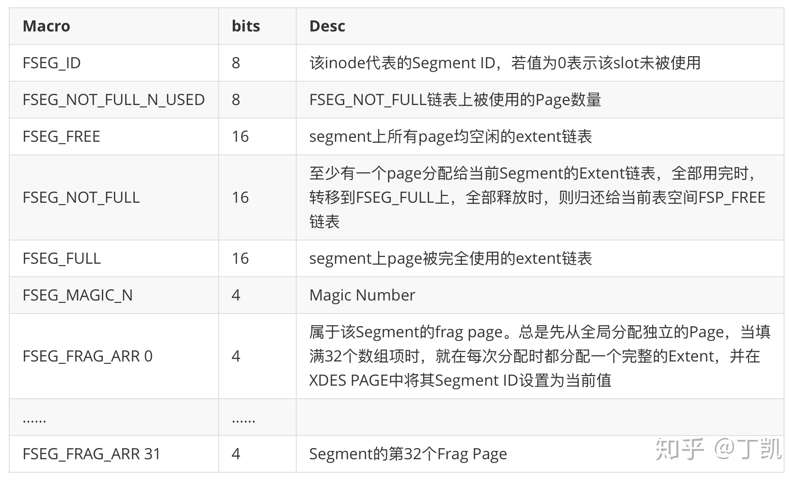

### Segment实现详解

#### Segment是什么

Segment是INNODB表空间管理中一个顶层的概念。INNODB的表空间被按照Segment管理，Segment是一个逻辑概念，其目的是管理底层的物理空间（如extent、page），通过segment将不同用途的物理空间隔离开，便于管理，而且，一般相同用途的page被放在同一个Segment，可提供更好的数据连续性。

例如，INNODB中会创建以下用途的Segment：

1. 回滚段。每个回滚段其实对应的便是UNDO表空间的一个segment
2. 索引。每个索引在INNODB中是一棵B+tree，为其创建两个segment。第一个用于存储非叶子节点内容，第二个用于存储叶子节点内容。

#### Segment与Inode

正如XDES用于描述extent一样，描述Segment的结构称为Inode（注意跟文件系统中inode的区别）。Inode存储了该Segment的所有关键信息，如id、extent链表等，用于加速物理页面分配。每个Inode占据192个字节：



Inode被存储在表空间中称为Inode Page的页面中，除了38字节的page header外，该页面还存储了85个Inode Entry。同时，表空间的page 0的fsp header中有Inode page 链表管理Inode分配用途。分配Segment其实就是分配一个空闲的Inode，这里的具体分配细节我们在后面详细描述。

#### 创建Segment

前面我们提到过，在创建索引以及UNDO回滚段时会创建Segment，接下来一一描述。创建索引时会创建两个segment，我们看看相关代码：

```c++
ulint btr_create(ulint type, space_id_t space, const page_size_t &page_size,
                 space_index_t index_id, dict_index_t *index, mtr_t *mtr)
{
  // 忽略该路径
  if (type & DICT_IBUF) {
    ...
  } else {
    // 分配第一个segment,用于管理非叶子节点存储空间
    // 第二个参数为0表示分配新的page
    // 将新分配的代表segment的Inode信息存储在该新分配Page的PAGE_HEADER + PAGE_BTR_SEG_TOP处
    block = fseg_create(space, 0, PAGE_HEADER + PAGE_BTR_SEG_TOP, mtr);
  }
  // 忽略该路径
  if (type & DICT_IBUF) {
    ...
  } else {
		// 创建第二个segemnt,用于管理叶子节点存储空间
    // 第二个参数不为0而是前面创建第一个segment时分配的page
    // 意味着将本次创建的代表segment的Inode信息存储在上面page的PAGE_HEADER + PAGE_BTR_SEG_LEAF处
    if (!fseg_create(space, page_no, PAGE_HEADER + PAGE_BTR_SEG_LEAF, mtr)) {
      ...
    }
}
```

这里需要注意一个东西，就是分配得到的Segment信息（主要是Inode位置信息）需要保存在一个特定的地方。在fseg_create()内除了分配一个Inode外，如果参数page_no为0的时候还会从该新创建的Segment上分配一个空闲page，在该page的指定位置处保存该Inode元信息，包括：

> **FSEG_HDR_SPACE**：segment所属表空间的id，4个字节
>
> **FSEG_HDR_PAGE_NO**：Inode所在Page的no，4个字节
>
> **FSEG_HDR_OFFSET**：Inode所在page的offset，2个字节

记录Inode位置信息的目的是以后该Segment要被整体删除的时候会很容易就能找到。

如果page_no不为0，该新分配的Segment的Inode信息会被记录在page_no页面中。如同索引中分配的两个Segment一样，第二个Segment的Inode信息被记录在第一个Segment分配的page中（这个也是B+tree的root page）。

创建回滚段时同样将该Segment的Inode位置信息记录在页面的特定位置。

```c++
page_no_t trx_rseg_header_create(space_id_t space_id,
                                 const page_size_t &page_size,
                                 page_no_t max_size, ulint rseg_slot,
                                 mtr_t *mtr)
{
  // Inode信息被存储在回滚段header page的TRX_RSEG + TRX_RSEG_FSEG_HEADER处
  block = fseg_create(space_id, 0, TRX_RSEG + TRX_RSEG_FSEG_HEADER, mtr);
  ...
}
```

#### Segment内空间管理

Segment内通过extent来管理存储空间。具体来说，每个Inode中都有以下几个extent相关链表：

> **FSEG_FREE**：空闲extent组成的链表
>
> **FSEG_NOT_FULL**：部分使用的extent构成的链表
>
> **FSEG_FULL**：完全被使用的extent构成的链表

需要说明的是，Segment内的extent也是来自表空间的，当Segment尚有可用extent时会直接使用，否则，Segment会向表空间申请分配可用extent。

除此之外，Segment内还有32个Fragment page，当分配不出连续page时候会选择从Frag page数组中查找。

从Segment内分配可用的page是一个常见需求，其核心实现流程是：

1. hint指示的页是所属extent属于该Segment，且其处于空闲状态，直接返回对应的page。hint是调用者传入的参数，其目的是尽量保证page的连续性；
2. hint指示的page所属extent状态是空闲，且Segment中的空闲page数量小于总page数量的1/8且碎片页被全部用完，那么将该extent从表空间分配给该Segment，然后分配hint page。这么做的目的是尽量保证能够将hint page分配给调用者；
3. 如果extent不是空闲状态，且segment inode中的空闲page数量 < 1/8，在inode当中获得一个空闲的extent，并且将这个extent descr对应的页返回。
4. hint page所属extent是XDES_FSEG状态，且这个extent中还有空闲page,从其中获取一个page.
5. 除了以上情况外，如果descr不是空闲的，但是inode还有其他的空闲extent,从其他的extent获得一个空闲page
6. 如果该Segment的fragment 数组还有空闲的碎片page，从空闲的碎片page中获得一个空闲页；
7. 如果连碎页也没有，直接申请分配一个新的extent，并在其中获取一个空闲的page.

