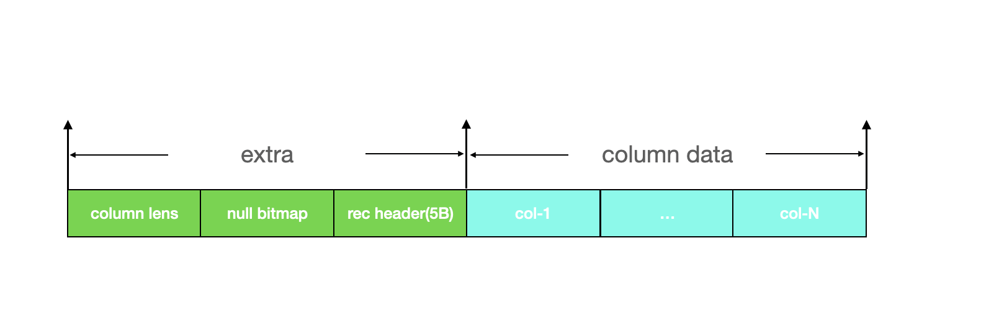
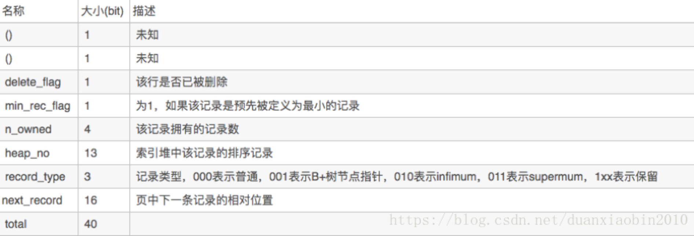

### 行记录到底占用多少存储空间

#### 行记录物理存储格式

本文中我们只以COMPACT为例说明，因为更老的格式已经没有探讨的必要性。



extra主要包含以下字段：

* **变长字段长度列表**：如果行记录中某些列为变长字段，例如varchar(N), blob等，那么存在该字段以记录变长列的实际占用空间，每个变长列都会对应列表中的一项。如果列的长度小于255字节，用1字节表示；如果大于255个字节，用2字节表示

* **NULL标志位**：表明该行数据是否有NULL值，这是一个位向量，每个bit代表某一列是否为null。null列在实际存储中并不占用物理空间。可为null的列数量为N，那么该标志位占用的存储空间为CEILING(N/8)字节。

* **记录头信息**：每个行记录均有该头信息，固定占用5字节,每位的含义参考下表：

  

  

在每个列的存储数据中，NULL不占该部分任何空间。此外还有两个隐藏列，事务ID列和回滚指针列，分别为6字节和7字节。若innodb表没有定义主键，每行还会增加一个6字节的rowid列。

#### 举例说明

假如建表语句为

```sql
create table t2 (a int not null);
```

那么分析该表的行记录占用的总存储空间为：

> * 变长字段长度列表为0：因为没有任何变长字段
> * NULL标志位空间为0：因为唯一字段a显示指明不为null
> * 记录头：固定5字节
> * 字段a：类型为int，占用4B
> * ROW_ID：由于没有指明唯一主键，因而系统会为其创建一个隐式主键，占据6个字节
> * TRX_ID：系统列，占据6个字节
> * ROLL_PTR：回滚段指针，占据7个字节

因而，每行占据的记录数为5 + 4 + 6 + 6 + 7 = 28

假如建表语句为：

```sql
create table t2 (a int);
```

与上面的例子相比该表的字段少了not null的限制，因而，其实际占用空间多了NULL标志位空间，因为只有一个字段，因而只需要1个字节即可，因此，该表的行记录占据存储空间为29字节。

假如建表语句为：

```sql
mysql> CREATE TABLE t (
 -> a VARCHAR(10),
 -> b VARCHAR(10),
 -> c CHAR(10),
 -> d VARCHAR(10)
 -> ) ENGINE=INNODB CHARSET=LATIN1 ROW_FORMAT=COMPACT;
 
 mysql> INSERT INTO t VALUES ('1','22','22','333'),('4',NULL,NULL,'555');
```

对于第一个行记录，

变长字段长度列表：

* 列a长度为1
* 列b长度为2
* 列c在LATIN1单字节编码下，长度固定，因此不会出现在该列表中
* 列d长度为3

 NULL标志位：

* 在表中可以为NULL的可变列为a、b、d，0< 3/8 < 1，所以NULL标志位占用1Byte


记录头信息：占据5个字节

ROWID：占据6个字节

TRX_ID：占据6个字节

ROLL_PTR：占据7个字节

列a：占据1个字节

列b：占据2个字节

列c：占据10个字节

列d：占据3个字节

因而该行记录占据总字节数为3+1+5+6+6+7+1+2+10+3=44

对于第2个行记录，

变长字段长度列表，占据2字节：

* 列a长度为1
* 列b、c为NULL，不占用空间，因此不会出现在该列表中，NULL标志位会标识那一列为NULL
* 列d长度为3

NULL标志位：

* 由于列b和c可以为NULL，因而需要1个字节空间

记录头信息：占据固定5个字节

ROWID：占据6个字节

TRX_ID：占据6个字节

ROLL_PTR：占据7个字节

列a：占据1个字节

列b：为NULL，占据0个字节

列c：为NULL，占据0个字节

列d：占据3个字节

因而该行记录占据总字节数为2+1+5+6+6+7+1+0+0+3=31


#### 行记录占用空间的计算原理

```c++
// 返回记录的总列数
ulint rec_offs_n_fields(const ulint *offsets)
{
 ulint n_fields;
 n_fields = offsets[1];
 ut_ad(n_fields > 0);
 ut_ad(n_fields <= REC_MAX_N_FIELDS);
 ut_ad(n_fields + REC_OFFS_HEADER_SIZE <= rec_offs_get_n_alloc(offsets));
 return (n_fields);
}

// 计算行记录数据列占用的总空间
ulint rec_offs_data_size(const ulint *offsets)
{
 ulint size;
 size = rec_offs_base(offsets)[rec_offs_n_fields(offsets)] & REC_OFFS_MASK;
 return (size);
}

ulint rec_offs_extra_size(const ulint *offsets)
{
 ulint size;
 size = *rec_offs_base(offsets) & ~(REC_OFFS_COMPACT | REC_OFFS_EXTERNAL);
 return (size);
}

ulint rec_offs_size(const ulint *offsets)
{
 return (rec_offs_data_size(offsets) + rec_offs_extra_size(offsets));
}
```

理解这里的关键在于搞清楚offsets数组的内容含义，该数组是通过函数*rec_get_offsets*构造而得：

```c++
#define rec_get_offsets(rec, index, offsets, n, heap) \
 rec_get_offsets_func(rec, index, offsets, n, heap)

ulint *rec_get_offsets_func(
  const rec_t *rec,
  const dict_index_t *index,
  ulint offsets,      
  ulint n_fields,  
  mem_heap_t **heap)
{
 ulint n;
 ulint size;

 if (dict_table_is_comp(index->table)) {
  switch (UNIV_EXPECT(rec_get_status(rec), REC_STATUS_ORDINARY)) {
   case REC_STATUS_ORDINARY:
    n = dict_index_get_n_fields(index);
    break;
   ...
 }
} else {
  n = rec_get_n_fields_old(rec, index);
}

 if (UNIV_UNLIKELY(n_fields < n)) {
  n = n_fields;
}
 // n代表列数量
 // REC_OFFS_HEADER_SIZE为2
 size = n + (1 + REC_OFFS_HEADER_SIZE);

 if (UNIV_UNLIKELY(!offsets) ||
   UNIV_UNLIKELY(rec_offs_get_n_alloc(offsets) < size)) {
  if (UNIV_UNLIKELY(!*heap)) {
   *heap = mem_heap_create_at(size * sizeof(ulint), file, line);
 }
  offsets = static_cast<ulint >(mem_heap_alloc(heap, size * sizeof(ulint)));
// 设置offsets[0]为offsets数组的总条目数
  rec_offs_set_n_alloc(offsets, size);
}

 // 设置offsets[1]为该行记录的列数
 rec_offs_set_n_fields(offsets, n);
 // 而在这里会设置offsets[REC_OFFS_HEADER_SIZE]为extra_size | REC_OFFS_COMPACT |  
 // REC_OFFS_EXTERNAL
 // 而在这里会设置offsets[n+2]为所有列的总长度(不包括extra_size)
 rec_init_offsets(rec, index, offsets);
 return (offsets);
}
```

根据上面的描述我们知道了offsets数组中的一些关键项的含义：

> * offsets[0]: offsets数组的总条目数
> * offsets[1]: 行记录的列数
> * offsets[REC_OFFS_HEADER_SIZE]: 即offsets[2]为extra_size | REC_OFFS_COMPACT |REC_OFFS_EXTERNAL
> * offsets[n+REC_OFFS_HEADER_SIZE]: 即offsets[n+2]为所有列的总长度(不包括extra_size)

因而上面根据offsets计算行记录的存储空间就比较简单了：

* *rec_offs_data_size*：计算所有列占据的总空间只需取offsets[n+REC_OFFS_HEADER_SIZE]即可
* *rec_offs_extra_size*：计算extra_size只需取offsets[REC_OFFS_HEADER_SIZE]然后做简单位运算即可