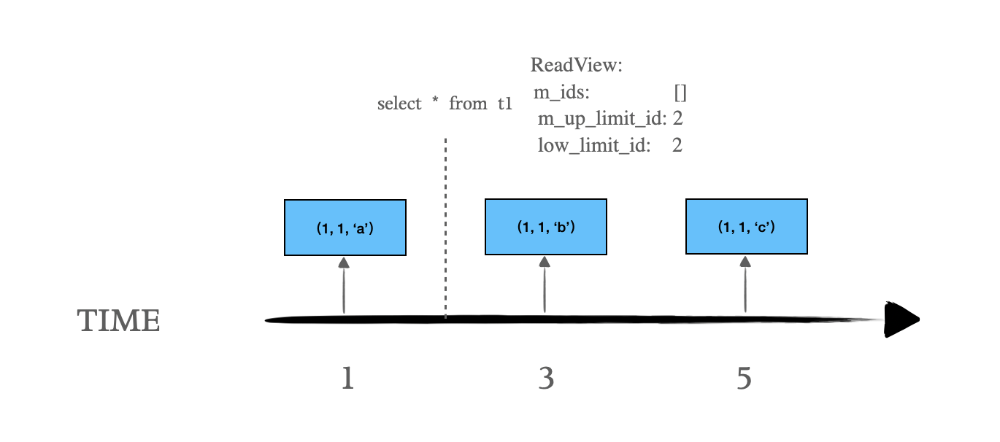
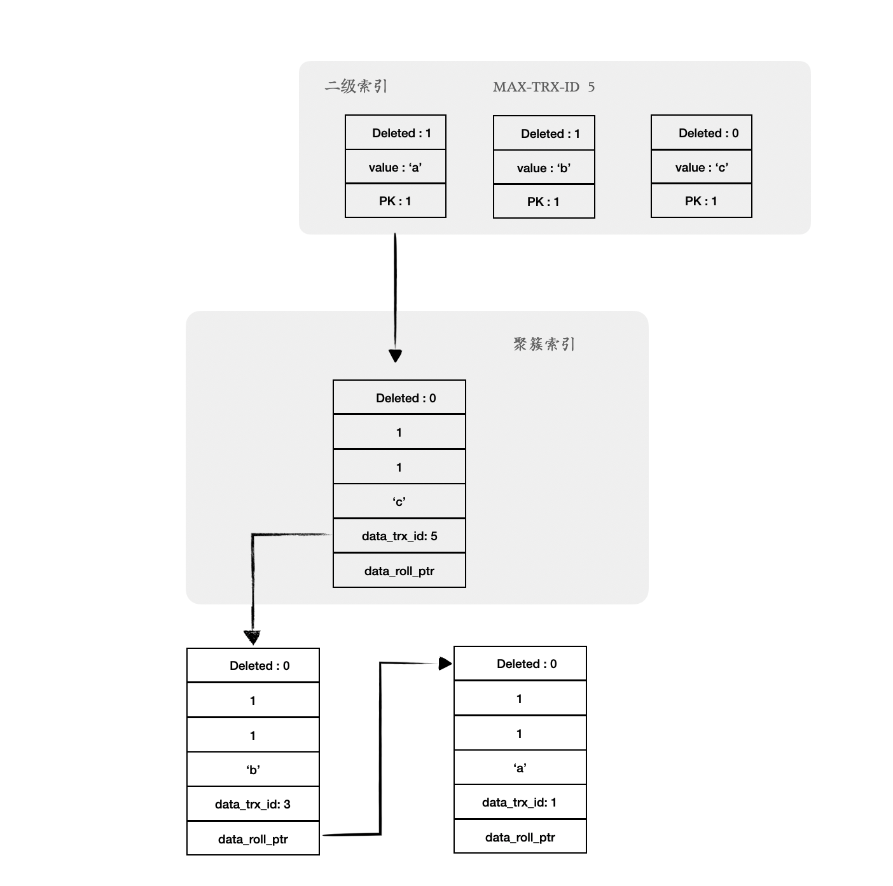

### UNDO LOG实现MVCC

InnoDB的多版本使用UNDO LOG来构建，UNDO LOG中记录了更改前的版本，如果更改数据的事务未提交，对于隔离级别大于等于READ COMMIT的事务而言，它不应该看到已修改的数据，而是应该给它返回老版本的数据。这个函数入口为*row_vers_build_for_consistent_read*。

```c++
dberr_t row_sel(...)
{
  if (node->read_view) {
    consistent_read = TRUE;
  } else {
    consistent_read = FALSE;
  }

  if (consistent_read) {
    // 如果是走主索引查询
    if (index->is_clustered()) {
      if (!lock_clust_rec_cons_read_sees(rec, index, offsets, node->read_view))
      {
        err = row_sel_build_prev_vers(node->read_view, index, rec, &offsets,
                                      &heap, &plan->old_vers_heap, &old_vers,
                                      &mtr);
        ...
      }
    // 走辅助索引查询
    } else if (!lock_sec_rec_cons_read_sees(rec, index, node->read_view)) {
      cons_read_requires_clust_rec = TRUE;
    }
  }
}

dberr_t row_vers_build_for_consistent_read(...)
{
  trx_id = row_get_rec_trx_id(rec, index, *offsets);
  version = rec;
  for (;;) {
    // 构建行记录的前一个版本
    bool purge_sees =
        trx_undo_prev_version_build(rec, mtr, version, index, *offsets, heap,
                                    &prev_version, NULL, vrow, 0, lob_undo);
    // 获取记录前一个版本的trx_id
    // 并判断如果对当前事务可见,那么返回该版本的记录即可
    trx_id = row_get_rec_trx_id(prev_version, index, *offsets);
    if (view->changes_visible(trx_id, index->table->name)) {
      buf = static_cast<byte *>(mem_heap_alloc(in_heap, rec_offs_size(*offsets)));
      *old_vers = rec_copy(buf, prev_version, *offsets);
      rec_offs_make_valid(*old_vers, index, *offsets);
      break;
    }
    // 否则还需要继续搜寻更前的记录版本
    version = prev_version;
  }
}
```

由于在修改聚集索引记录时，总是存储了回滚段指针和事务id，可以通过该指针找到前一个版本的undo 记录，通过事务Id来判断记录的可见性。当旧版本记录中的事务id对当前事务而言是不可见时，则继续向前构建，直到找到一个可见的记录或者到达版本链尾部。

‌根据当前记录版本去获取前一个版本的UNDO LOG内容主要在函数*trx_undo_get_undo_rec_low*中实现：

```c++
// 根据当前记录找到前一个版本的UNDO LOG主要在下面的函数
// 其中rollptr即是记录前一个版本的undo log位置信息
trx_undo_rec_t *trx_undo_get_undo_rec_low()
{
  // 解码rollptr
  trx_undo_decode_roll_ptr(roll_ptr, &is_insert, &rseg_id, &page_no, &offset);
  space_id = trx_rseg_id_to_space_id(rseg_id, is_temp);

  // 根据rollptr中的space id和page no读出数据页
  buf_block_t *block = trx_undo_block_get_s_latched(
      page_id_t(space_id, page_no), page_size, &mtr);
  undo_page = buf_block_get_frame(block);

  // 再根据offset从数据页中读取rec内容
  undo_rec = trx_undo_rec_copy(undo_page + offset, heap);
  return (undo_rec);
}
```

‌另外，需要特别说明的是：由于UNDO LOG中只记录更新所涉及到的column，并不包含行记录的完整column内容，因此，我们还需要构建出完整行记录数据，如下：

```c++
bool trx_undo_prev_version_build(...)
{
  ...
  // 获取前一个版本的undo log内容,保存在undo_rec中
  trx_undo_get_undo_rec(roll_ptr, rec_trx_id, heap, is_temp,
                            index->table->name, &undo_rec);
  // 获取undo rec内的系统column字段内容(包括trx_id, rollptr, info_bits)
  ptr = trx_undo_update_rec_get_sys_cols(ptr, &trx_id, &roll_ptr, &info_bits);
  // 解析undo rec内的update column
  ptr = trx_undo_update_rec_get_update(ptr, index, type, trx_id, roll_ptr,
                                       info_bits, NULL, heap, &update, lob_undo,
                                       type_cmpl);
  if (row_upd_changes_field_size_or_external(index, offsets, update)) {
    ...
    // 将rec转化为dtuple_t对象
    entry = row_rec_to_index_entry(rec, index, offsets, &n_ext, heap);
    ...    
    // 根据update column信息以及之前的rec构建完整的前一个版本内容
    // 由于undo log中记录了update前的旧值，因此我们可以很容易地根据新内容构建老版本
    row_upd_index_replace_new_col_vals(entry, index, update, heap);
    // 然后将老版本dtuple_t转化成为rec直接返回  
    *old_vers = rec_convert_dtuple_to_rec(buf, index, entry, n_ext);
  } else {
   ...
  }
}
```

#### 辅助索引的MVCC

前面我们描述了对于聚簇索引如何通过UNDO LOG实现一致性读，那如果是辅助索引如何实现一致性读呢？

```c++
trx_id_t page_get_max_trx_id(const page_t *page)
{
  return (mach_read_from_8(page + PAGE_HEADER + PAGE_MAX_TRX_ID));
}

// 判定rec对当前事务是否可见
// 这里返回true表示一定可见，否则还需要通过回溯聚簇索引来进一步判定可见性
bool lock_sec_rec_cons_read_sees(...)
{
  trx_id_t max_trx_id = page_get_max_trx_id(page_align(rec));
  return (view->up_limit_id() > max_trx_id);
}

dberr_t row_sel(...)
{
  if (consistent_read) {
    // 如果是走主索引查询
    if (index->is_clustered()) {
      ...
    // 走辅助索引查询,如果只比较二级索引无法得出可见性
    // 那需要回溯主索引
    } else if (!lock_sec_rec_cons_read_sees(rec, index, node->read_view)) {
      cons_read_requires_clust_rec = TRUE;
    }
  }
  // 如果是delete mark且无需回溯聚簇索引来判断,那么忽略这条记录
  if (rec_get_deleted_flag(rec, dict_table_is_comp(plan->table)) &&
      !cons_read_requires_clust_rec) {
    goto next_rec;
  }

  if (plan->must_get_clust || cons_read_requires_clust_rec) {
    err = row_sel_get_clust_rec(node, plan, rec, thr, &clust_rec, &mtr);
    // clust_rec为null表示回溯聚集索引判断的时候发现该二级索引记录同样不可见
    // 忽略该记录
    if (clust_rec == NULL) {
      goto next_rec;
    }

    // 如果聚簇索引中是一个delete mark,表示看到的操作是一个delete mark
    // 同样忽略该记录
    // 主键更新可能会发生这种情况
    if (rec_get_deleted_flag(clust_rec, dict_table_is_comp(plan->table))) {
      goto next_rec;
    }
  }
}

// 通过辅助索引来查询聚簇索引记录
dberr_t row_sel_get_clust_rec(...)
{
  clust_rec = btr_pcur_get_rec(&(plan->clust_pcur));
  if (!node->read_view) {
    ...
  } else {
    old_vers = NULL;
    // 根据ReadView判断该聚簇索引是否可见,如果不可见,通过undo log继续向前回溯
    if (!lock_clust_rec_cons_read_sees(clust_rec, index, offsets, node->read_view))
    {
      err = row_sel_build_prev_vers(node->read_view, index, clust_rec, &offsets,
                                  &heap, &plan->old_vers_heap, &old_vers, mtr);
    }
    // 判断该二级索引中的记录跟undo log中是否一致
    if (old_vers || rec_get_deleted_flag(rec, dict_table_is_comp(plan->table))) {
      err = row_sel_sec_rec_is_for_clust_rec(rec, plan->index, clust_rec, index,
                                             thr, rec_equal);
    }
  }
  *out_rec = clust_rec;
}
```

‌接下来我们举例来说明聚簇索引和辅助索引如何通过MVCC实现一致性读。

‌**聚簇索引实现一致性读示例**

```
// 建表语句如下
create table t1(c1 int primary key, c2 int, c3 char(10), index i_c3(c3));
```

| session 1        | session 2                             | 备注             |
| ---------------- | ------------------------------------- | ---------------- |
|                  | insert into t1 values(1, 1, 'a')      | TRX1: trx_id = 1 |
| begin            |                                       |                  |
| select * from t1 |                                       | 结果(1, 1, 'a')  |
|                  | update t1 set c3 = 'b' where c3 = 'a' | TRX2: trx_id = 3 |
| select * from t1 |                                       | 结果(1, 1, 'a')  |
|                  | update t1 set c3 = 'c' where c3 = 'b' | TRX3: trx_id = 5 |
| select * from t1 |                                       | 结果(1, 1, 'a')  |

下图中记录存在三个版本，在Repeatable-Read下select * from t1 查询返回的是第一个老的版本(1,1,’a’)。



在聚簇索引中，最新的版本记录为 r3: (1, 1, 'c', 5, roll_ptr)，其中5为事务id，数据就在page中；上一个版本为r2(1, 1, 'b', 3,roll_ptr)，可通过r3的roll_ptr字段指向的undo log构造出来。而最老的版本为r1(1,1,'a', 1, roll_ptr), 可通过r2的roll_ptr字段指向的undo log构造出来。‌

在辅助索引中，最新的版本记录为sr3: ('c',1)，数据就在当前二级索引page中；上一个版本为sr2: ('b',1)，数据也在当前二级索引page中，但打上了delete mark标记；而最老的版本为sr1('a',1)，数据也在当前二级索引page中，但同样打上了delete mark标记。如下图：



‌以上节为例，默认隔离级别为RepeatableRead，select * from t1， 查询结果为老版本(1,1,’a)。其对应的ReadView为：

```
ReadView
m_ids: ()
m_up_limit_id: 2
m_low_limit_id: 2
```

‌首先查询到最新的记录(1,1,’c’)， 其事务id为5， 大于m_low_limit_id（2）所以不可见； 然后通过roll_ptr构建上一个版本(1,1,’b’), 其事务id为3，大于m_low_limit_id（2）仍然不可见；再通过rool_ptr构建出(1,1,’a’)，其事务id为1， 小于m_up_limit_id（2），可见；所以最后返回(1,1,’a’)。

‌**辅助索引实现一致性读**

‌辅助索引记录中没trx_id和rollptr字段，但辅助索引页面中记录了该page所修改的事务最大的trx_id，参考*page_update_max_trx_id*。

‌判断辅助索引记录可见性时，首先用此page的最大事务id比较，如果它小于当前view的m_up_limit_id则认为此记录可见，否则需要从聚簇索引中读取记录来判断可见性，参考*lock_sec_rec_cons_read_sees*。

| session 1                                          | session 2                             | 备注             |
| -------------------------------------------------- | ------------------------------------- | ---------------- |
|                                                    | insert into t1values (1, 1, 'a')      | TX1: id = 1      |
| begin                                              |                                       |                  |
| select * from t1                                   |                                       | 结果 (1, 1, 'a') |
|                                                    | update t1 set c3 = 'b' where c3 = 'a' | TX1: id = 3      |
| select * from t1                                   |                                       | 结果 (1, 1, 'a') |
|                                                    | update t1 set c3 = 'c' where c3 = 'b' | TX1: id = 5      |
| select * from t1 force index(i_c3) where c3 >= 'a' |                                       | 结果 (1, 1, 'a') |

‌例如下图中select * from t1 force index(i_c3) where c3 >= ‘a’，查询结果为（1，1，’a’)。我们强制使用二级索引i_c3，查询会先从二级索引读取符合条件(c3>=’a’)的记录再回cluster index获取完整记录。

其对应的ReadView为：

```
ReadView
m_ids: (null)
m_up_limit_id: 2
m_low_limit_id: 2
```

‌假设二级索引所在页面的最大事务id为5，当前view->m_up_limit_id为2， 先读取记录(‘a’，1), 不可见，需要回cluster index查找，根据上节依次回溯到可见版本(1,1,’a)，‌并且判断二级索引列值和聚集索引列值一致(*row_sel_sec_rec_is_for_clust_rec*)，因此可以返回记录(1,1,’a’);

‌接着读取记录(‘b’,1)，事务对记录不可见，需要回cluster index查找，依然回溯到可见版本(1,1,’a’)，但此时二级索引列值和聚集索引列值（’a’!=’b’)不一致, 因此（’b’,1)不符合条件。

‌再读取记录(‘c’,1)，事务对记录不可见，需要回cluster index查找，依然回溯到可见版本(1,1,’a’)，但此时二级索引列值和聚集索引列值（’a’!=’c’)也不一致, 因此（’c’,1)也不符合条件。

‌因此最终返回符合条件的记录为(1,1,’a’)。

‌我们再看下面这个例子，select * from t1 force index(i_c3) where c3 >= ‘a’，查询结果为（1，1，’c’)。

| session 1                                          | session 2                             | 备注             |
| -------------------------------------------------- | ------------------------------------- | ---------------- |
|                                                    | insert into t1values (1, 1, 'a')      | TX1: id = 1      |
|                                                    | update t1 set c3 = 'b' where c3 = 'a' | TX2: id = 3      |
|                                                    | update t1 set c3 = 'c' where c3 = 'b' | TX3: id = 5      |
| begin                                              |                                       |                  |
| select * from t1 force index(i_c3) where c3 >= 'a' |                                       | 结果 (1, 1, 'c') |

其对应的ReadView为：

```
ReadView
m_ids: (null)
m_up_limit_id: 6
m_low_limit_id: 6
```

‌先读取记录(‘a’，1)，二级索引页面最大事务id为5，可见， 再判断（‘a’,1)为del mark记录，不符合条件；

然后读取记录(‘b’，1)，二级索引页面最大事务id为5，可见， 再判断（‘b’,1)为del mark记录，不符合条件；

再读取记录(‘c’，1), 二级索引页面最大事务id为5，可见， 且（’c’,1)为非del mark记录，符合条件。

因此最终回表返回符合条件的记录为(1,1,’c’)。