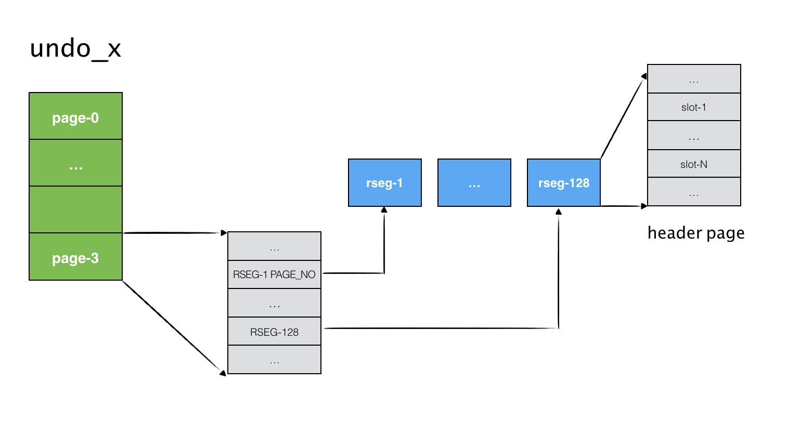
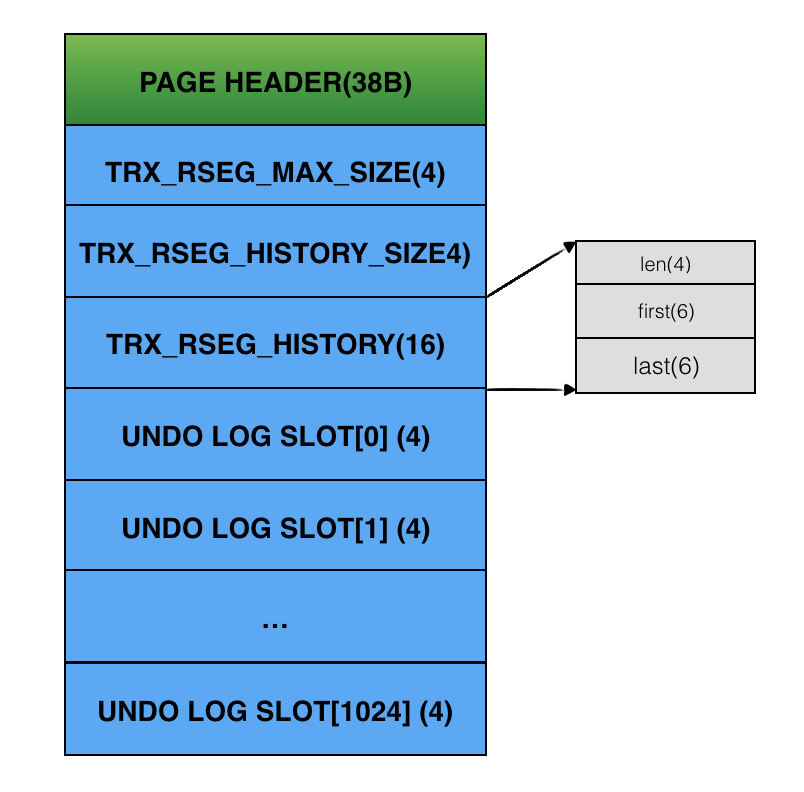
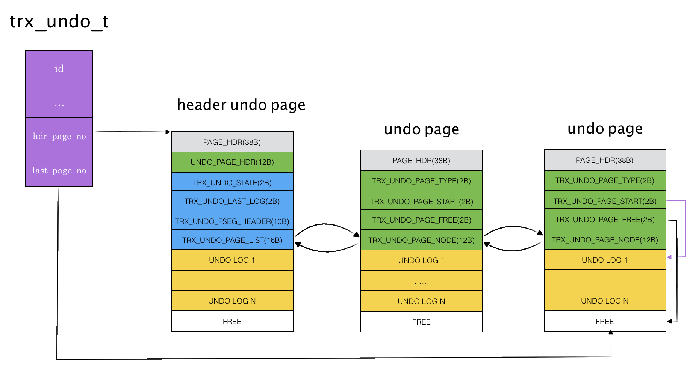
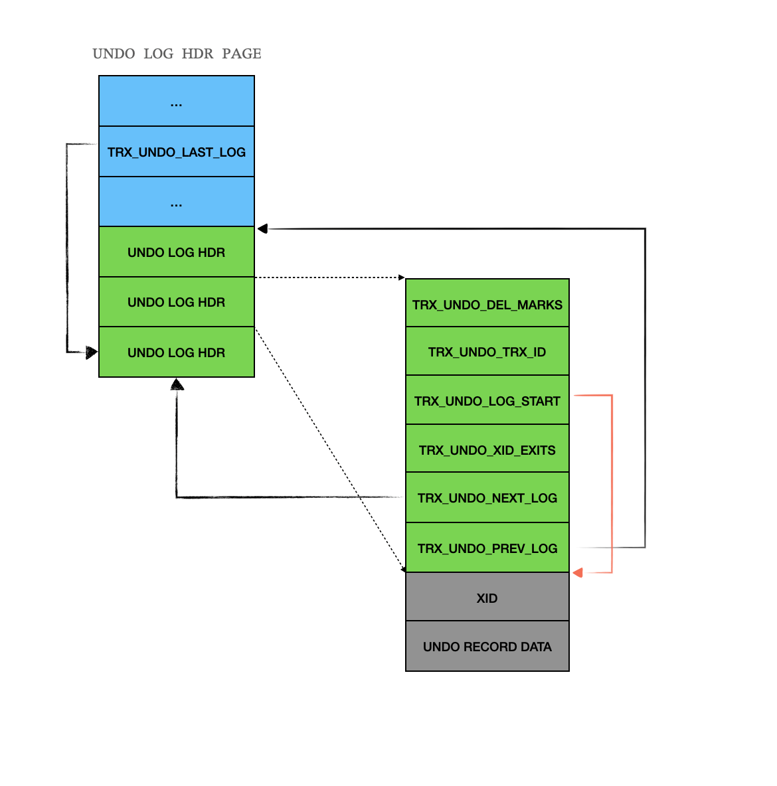
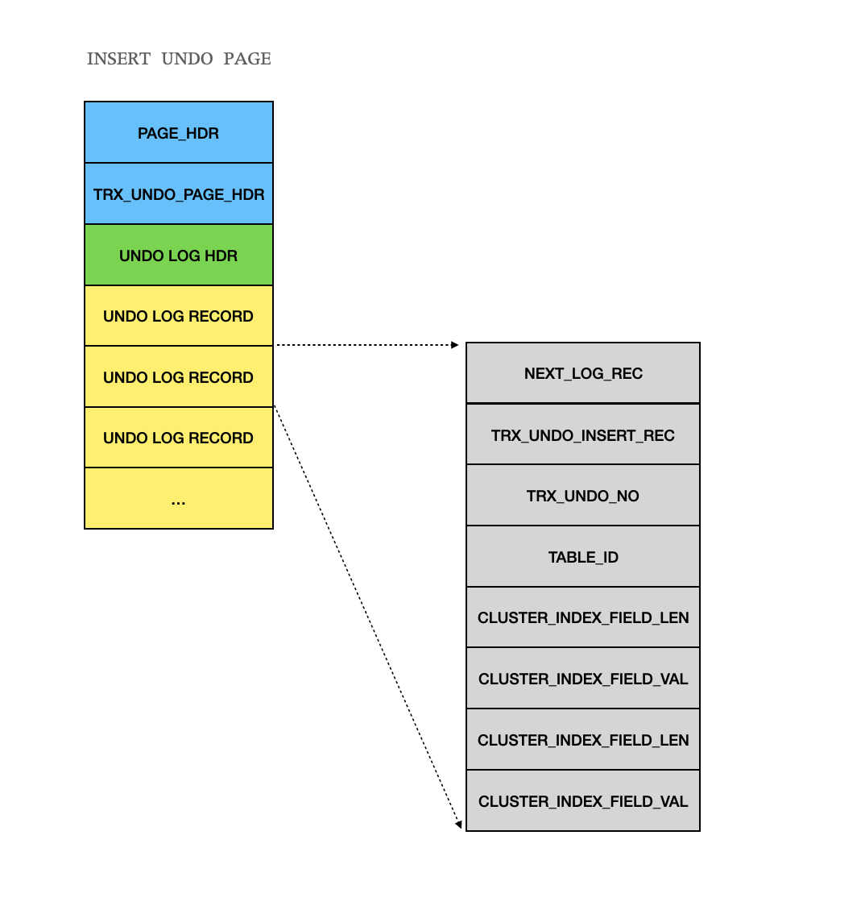
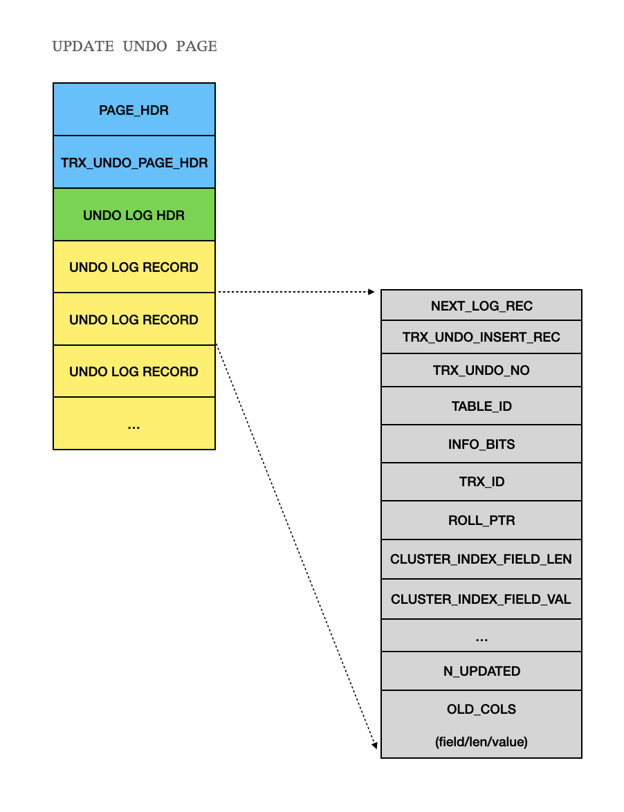

### UNDO LOG物理格式

InnoDB采用表空间 + 回滚段的方式来存储undo log。回滚段定义了UNDO文件的组织方式。‌

在实现中，可以将UNDO LOG内容与INNODB中的其他数据存储在同一个文件，也可以将UNDO LOG单独存储，

这取决于MYSQL initialize时的参数配置。文章中主要以独立UNDO文件来描述。

**UNDO TABLE SPACE**

UNDO TABLE SPACE指的是UNDO LOG 表空间，每个表空间对应于一个独立的底层物理文件。这个没什么可以更

多说的。可以设置*undo_tablespaces*来决定要创建的UNDO表空间数目（UNDO 文件数量）。该值默认为8。

‌**UNDO ROLLBACK SEGMENT**‌

使用独立表空间存储UNDO LOG，会为每个undo table space创建一定数量回滚段，这受参数 

*srv_rollback_segments*控制，默认值为128。将TABLE SPACE划分为SEGMENT的目的是可以让每个事务工作在

不同的SEGMENT上而不会互相干扰，以此提高并发度。

使用独立表空间组织形式的UNDO TABLE SPACE的组织可以用下图来表示：

独立UNDO 表空间的存储特点：

> * 表空间的第4个page(page-3)内主要存储该表空间内的每个回滚段的header page no，构成一个数组，数组大小为回滚段数量，数组的每一项占据4B
> * 回滚段的header page内有undo log slot数组，如果page大小为16KB，那么该数组大小为1024，数组的每一项代表一个undo log，事务运行需要记录undo log时会寻找当前空闲slot分配undo log

‌另外，临时表空间也存在自己的回滚段，临时表空间在每次系统启动时都会创建，因此，临时表空间的信息无需持久化，以后可以看到，创建临时表空间时无需记录REDO LOG。

**回滚段的HEADER PAGE**

Rollback Segment的Header Page布局如下图所示：

‌一些关键字段：

> * **PAGE** **HEADER**：这是INNODB中的通用的PAGE HEADER，占据38字节，这里不作仔细描述
> * **TRX_RSEG_MAX_SIZE**：回滚段最大的大小，一般情况下为无限大
> * **TRX_RSEG_HISTORY_SIZE**：TRX_RSEG_HISTORY链表大小，即链表上的节点数量
> * **TRX_RSEG_HISTORY**：history链表。链表上的每个节点是一个地址结构，占据6个字节，包括page_no和offset。通过history list将不再使用的undo log构建成为一个链表，方便以后回收
> * **UNDO LOG SLOTS**：默认有1024项，每一项对应一个UNDO LOG，该数组用来分配空闲UNDO LOG。

**UNDO PAGE 格式**

UNDO LOG RECORD存储于UNDO PAGE中。UNDO LOG也存在两种类型：insert undo和update undo。其中

insert undo记录insert语句中生成的undo log record，而update undo则记录update/delete等语句中生成的

undo log record。每个undo page只存储一种类型的UNDO LOG。每创建一个trx_undo_t对象时，会先分配一个

UNDO SEGMENT，以后该事务上产生的所有undo log record所需page均从该SEGMENT上分配。而UNDO 

SEGMENT 的第一个PAGE被称为HEADER PAGE。HEADER PAGE与普通PAGE不一样的地方在于：它上面除了存储

普通的UNDO LOG REORD外，还有UNDO_SEG_HDR信息，包含如下字段：

> - **TRX_UNDO_STATE**：标记事务状态，有TRX_UNDO_ACTIVE/TRX_UNDO_PREPARED等状态
> - **TRX_UNDO_LAST_LOG**：最后一个undo日志的在undo page中的偏移，通过该字段可快速定位最新undo日志的位置
> - **TRX_UNDO_FSEG_HEADER**：不确定，占据10个字节大小
> - **TRX_UNDO_PAGE_LIST**：该trx_undo_t所有的UNDO PAGE构成的双向链表头部。占据16个字节。通过它就可以遍历该trx_undo_t的所有undo page，进而找到所有的undo log rec内容，设计得还是很巧妙的

‌普通UNDO PAGE包含了header和body两个大的部分，而header中又包含两个子部分，分别是COMMON PAGE

HEADER和UNDO_PAGE_HDR。其中COMMON PAGE HEADER占据38字节，是所有PAGE共享，这里不做说明。

UNDO_PAGE_HDR包含以下字段：

> - **TRX_UNDO_PAGE_TYPE**：该undo page记录的undo类型，占据2个字节，目前有TRX_UNDO_INSERT、TRX_UNDO_UPDATE两种类型
> - **TRX_UNDO_PAGE_START**：该undo page记录的数据起始位置，undo log从page内的该偏移处写入，就是指图中的Data Region的起始偏移
> - **TRX_UNDO_PAGE_FREE**：该undo page的空闲位置，下次写入会从该位置开始
> - **TRX_UNDO_PAGE_NODE**：这里是前后向指针，用于将该undo page串联至trx_undo_t的page链表上，每个指针大小为6B（包括space id以及page no），总大小12B

‌UNDO PAGE HEADER占据的大小为18B。trx_undo_t、header page、undo page三者组成的关系如下图所示：

‌trx_undo_t内的*hdr_page_no*记录了header undo page的编号，*last_page_no*记录了正在使用的undo page的编

号。header page内的TRX_UNDO_FSEG_HEADER为undo page链表的头部，每个undo page通过其

TRX_UNDO_PAGE_NODE将自身串联在链表中。

**UNDO LOG HEADER**

每个UNDO LOG都对应一个UNDO LOG HEADER，包含如下字段：

> * TRX_UNDO_DEL_MARKS：暂时不清楚含义
> * TRX_UNDO_TRX_ID：产生该UNDO LOG的事务id
> * TRX_UNDO_LOG_START：UNDO LOG DATA所在偏移
> * TRX_UNDO_XID_EXISTS：UNDO LOG HEADER中是否包含XID信息，本例中演示的场景是不含XID信息的头部（字段值为FALSE），也是老版本的格式，新版本中在头部包含了XID，会在接下来分析
> * TRX_UNDO_NEXT_LOG：该UNDO PAGE中后一个UNDO LOG HEADER所在偏移
> * TRX_UNDO_PREV_LOG：该UNDO PAGE中前一个UNDO LOG HEADER所在偏
> * RESERVED：预留字段

UNDO LOG HEADER存储在header undo page中，按照道理说，每个事务有唯一的undo log，那么header undo page也不会存储多个UNDO LOG HEADER，那为什么每个UNDO LOG HEADER中还设置了TRX_UNDO_NEXT_LOG和TRX_UNDO_PREV_LOG字段呢？

这是由于UPDATE UNDO LOG的REUSE导致的。一个UPDATE UNDO LOG在事务提交时如果满足若干条件，那么它会被加入回滚段的cache链表，以备下次新事务申请UNDO LOG时直接复用。但是这个被缓存的UPDATE UNDO LOG中的内容可能尚未被清理，于是老的记录内容必须被保留，因此，只能在原UNDO LOG PAGE内再创建一个新的UNDO LOG HEADER，这样，一个UNDO PAGE内便会有多个UNDO LOG HEADER共存，但是只有一个UNDO LOG是处于活跃状态。

关于UPDATE UNDO LOG的缓存和复用可参考函数*trx_undo_reuse_cached*。

**INSERT UNDO LOG RECORD格式**

各个字段含义：

> - NEXT_LOG_REC：下一个UNDO LOG RECORD的位置
> - type：类型，占据1个字节，值为TRX_UNDO_INSERT_REC
> - undo_no: 事务的提交trx_no
> - table_id: undo log记录所属的表
> - field_len & field_value：该记录的聚簇索引的内容，如果聚簇索引是联合主键，那么会有多项field_len和field_value

**‌update undo record格式**

‌各个字段含义：

> - type：类型，可能是TRX_UNDO_DEL_MARK_REC、TRX_UNDO_UPD_DEL_REC或者TRX_UNDO_UPD_EXIST_REC
> - undo_no: 事务的提交trx_no
> - table_id: undo log记录所属的表
> - info_bits: 作用不明
> - trx_id：产生该undo log记录的事务id
> - rollptr：回滚段，指向该记录前向记录的指针
> - field_len & field_value：该记录的聚簇索引的内容，如果聚簇索引是联合主键，那么会有多项field_len和field_value
> - n_updated：产生该undo log record的事务修改的列数量
> - old_col：事务修改的列的旧值，每个旧值中记录修改列的no、旧值长度以及旧值内容，如果修改多列旧值（记录在n_updated中），那就在undo log中存在多个旧值项。