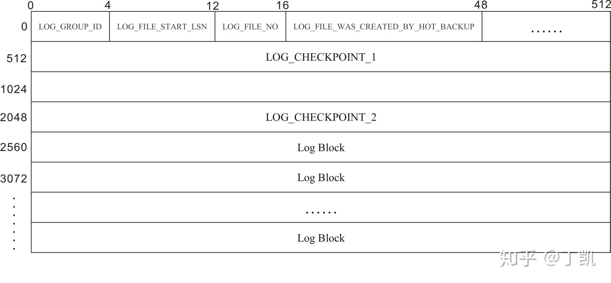
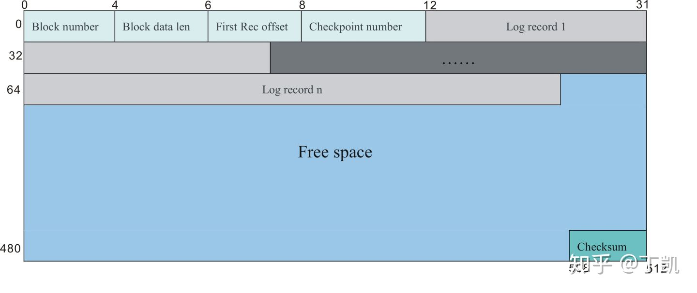
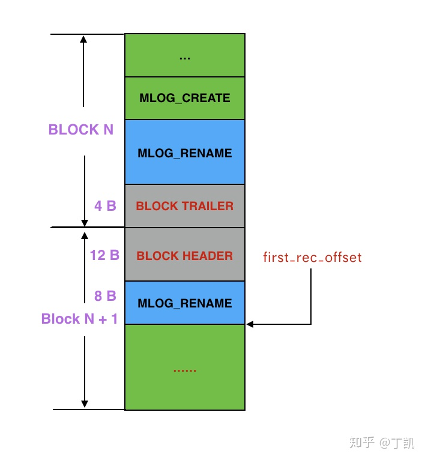

### Write-Ahead-Log物理格式

#### 概述

任何对Innodb表的更新，Innodb都会将更新操作转化为WAL(write ahead log)并写入日志文件，WAL中记录了修改的详细信息。WAL日志在事务提交时会保证被写入持久化存储设备以保证事务的可靠性，WAL技术是保证数据库可靠存储以及提升性能的最重要手段。本文将详细描述WAL日志在磁盘上的物理组织格式。

#### WAL文件组

MySQL WAL日志是一组日志文件集合，它们在数据库实例创建时预创建，并在数据库运行中被循环使用。WAL文件大小和数目可以通过参数设置，见*innodb_log_file_size* 和 *innodb_log_files_in_group* 。

#### WAL文件

每个WAL文件的前2048字节存放文件头信息。文件头后面是WAL内容，按照BLOCK为单位分割，BLOCK大小默认为512字节。日志文件布局如下图所示：

其中几个重要的字段：

日志文件头共占用4个**OS_FILE_LOG_BLOCK_SIZE**的大小，即2048，有以下字段：

- LOG_GROUP_ID：该log文件所属的日志组，占用4个字节，当前均为0
- LOG_FILE_START_LSN: 该log文件记录的开始日志的lsn，占用8字节
- LOG_FILE_WAS_CRATED_BY_HOT_BACKUP 备份程序所占用的字节数，共占用32字节
- LOG_CHECKPOINT_1/LOG_CHECKPOINT_2 两个记录InnoDB checkpoint信息的字段，分别从文件头的第二个和第四个block开始记录，只使用日志文件组的第一个日志文件。 从地址2KB偏移量开始，其后就是顺序写入的各个日志块（log block）

#### WAL日志块

所有WAL以日志块为单位组织在日志文件中，默认为512字节。所有的日志以块为单位顺序写入文件。每一条记录都有自己的LSN（log sequence number， 表示从日志记录创建开始到特定的日志记录已经写入的字节数）。每个日志块包含一个日志头（12字节）、一个尾部（4字节，记录Block内容的crc），以及一组日志记录（最多512 – 12 – 4 = 496字节） 。

日志块头包含以下几个字段：

- block_number：4B，表示这是第几个block块。 可通过LSN计算: *log_block_convert_lsn_to_no*
- block_data_len：2B，表示该block中已经写入的字节数，若是整个块都写满了的话，该值是 512
- first_rec_offset：2B，表示该block中第一个全新的log record的开始log record的偏移量
- log_record_data：496B，存放真正的redo日志内容
- checksum：4B，此block数据校验和，用于正确性校验

这里需要特别解释的是first_rec_offset字段：在innodb事务层产生的WAL日志其实是被组织成为log record，每个record都有特定的类型以及相应的内容。log record可能会跨Block存储的情况，因而需要在Block Header中存储first_rec_offset来代表该Block中第一个起始log record在该Block内的偏移，需要注意的是：first_rec_offset包含Block Header的大小。如下例：

该例中，MLOG_RENAME该log record跨了两个Block，其中8B落在了第二个Block，于是第二个Block的Block Header字段中的first_rec_offset值为12 + 8 = 20。

存在两种特殊情况：1. Block中的紧接着Header的就是一个新log record的起始字节，那么first_rec_offset便是Block Header Size，即12；2. 若Block内的所有有效数据存储的都是上一个Block内最后一个log record的内容，那么first_rec_offset便为0。

#### LSN和文件偏移量之间转换

在Innodb中LSN是一个非常重要的概念，表示某个log record从日志记录创建开始已经写入的字节数。LSN的计算是包含BLOCK的头和尾字段的。

那如何由一个给定LSN的日志，在日志文件中找到它存储的位置（文件以及在文件内的偏移）是一个比较有意思的问题，原理也比较简单，感兴趣的朋友可以研究下函数*log_files_real_offset_for_lsn*，这里便不再赘述。