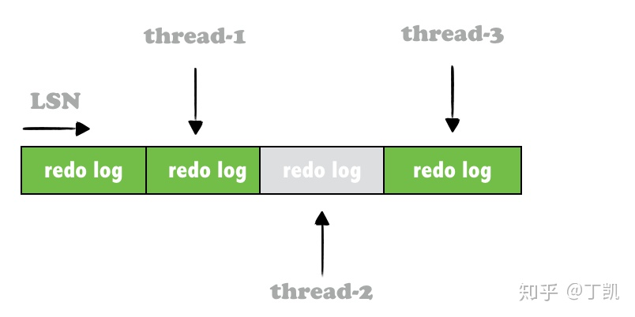
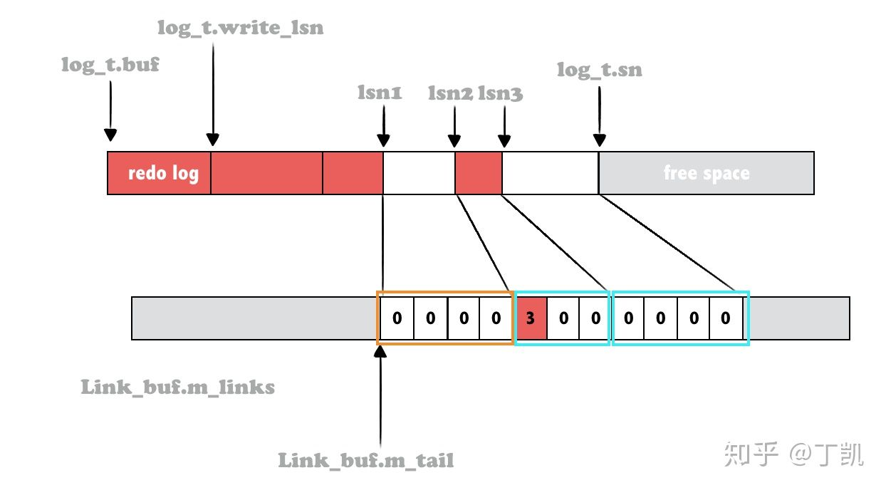
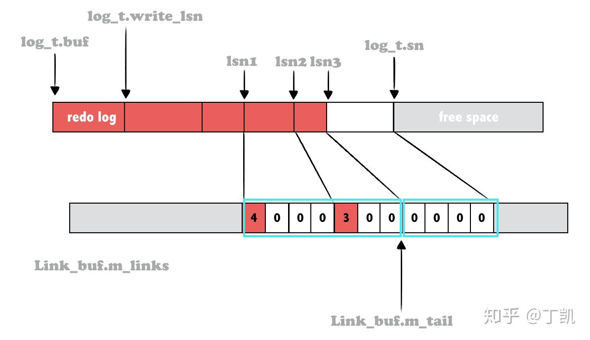
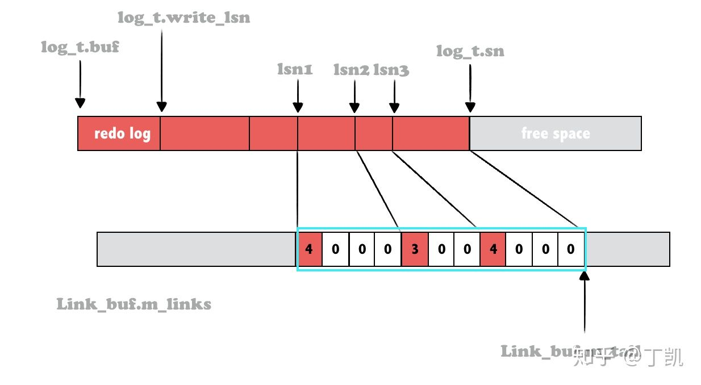
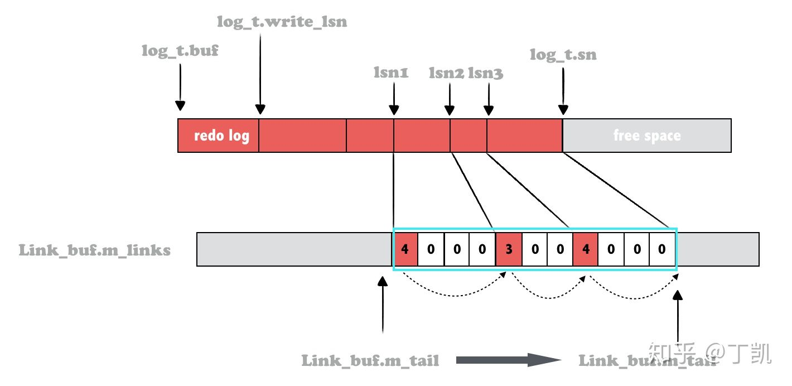

### 无锁WAL实现

#### 概述

数据库系统一般采用WAL(write ahead log)技术来实现原子性和持久性，MYSQL也不例外。WAL中记录事务的更新内容，通过WAL将随机的脏页写入变成顺序的日志刷盘，可极大提升数据库写入性能，因此，WAL的写入能力决定了数据库整体性能的上限，尤其是在高并发时。

在MYSQL 8以前，写日志被保护在一把大锁之下，本来并行事务日志写入被人为串行化处理。虽简化了逻辑，但也极大限制了整体的性能表现。8.0很大的一部分工作便是将日志系统并行化。

#### 日志并行化

日志并行化的思路也很简单：将写日志拆分为两个过程：

1. 从内存log buffer中为日志预留空间

2. 将日志内容拷贝至1预留的空间

而在这两个步骤中，只需要步骤1保证在多并发并发预留空间时的正确性即可，确保并发线程预留的日志空间不会交叉。一旦预留成功，步骤2各并发线程可互不干扰地执行拷贝至自己的预留空间即可，这天然可并发。

而在步骤1中也可以使用原子变量来代替代价较高锁实行预留，在mysql 8实现中，其实就两行代码：

```cpp
Log_handle log_buffer_reserve(log_t &log, size_t len) {
    ...
    const sn_t start_sn = log.sn.fetch_add(len);
    const sn_t end_sn = start_sn + len;
    ...
}
```

可以看到，只需要一个原子变量log.sn记录当前分配的位置信息，下次分配时更新该log.sn即可，非常简洁优雅。

8.0中引入的并行日志系统虽然很美好，但是也会带来一些小麻烦，我们下面会详细描述其引入的日志空洞问题并阐述其解决方案。

#### Log Buffer空洞问题

Mysql 8.0中使用了无锁预分配的方式可以使MTR并行地将WAL日志写入到Log Buffer，提升性能。但这样势必会带来Redo Log Buffer的空洞问题，如下：



上图中，3个线程分别分配了对应的redo buffer，线程1和3已经完成了wal日志内容的拷贝，而线程2则还在拷贝中，此时写入线程最多只能将thread-1的redo log写入日志文件。 为此，MySQL 8.0中引入了**Link_buf**。

#### Link_buf原理

Link_buf用于辅助表示其他数据结构的使用情况，在Link_buf中，如果一个索引位置index处存储的是非0值n，则表示Link_buf辅助标记的那个数据结构，从index开始后面n个元素已被占用。

```cpp
template <typename Position = uint64_t>
class Link_buf {
 private:
  ...
  size_t m_capacity;
  std::atomic<Distance> *m_links;
  alignas(INNOBASE_CACHE_LINE_SIZE) std::atomic<Position> m_tail;
};
```

Link_buf是一个定长数组，且保证数组的每个元素的更新是原子操作的。以环形的方式复用已经释放的空间。

同时Link_buf内部维护了一个变量*m_tail*表示当前最大可达的LSN。

Innodb日志系统中为Log Buffer维护了两个Link_buf类型的变量*recent_written*和*recent_closed*。示意图如下：



上图中，共有两处日志空洞，起始的LSN为lsn1与lsn3，均有4个字节。而lsn2处的redo log已经写入，共3个字节。在*recent_written*中，lsn1开始处的4个atomic均是0，lsn3同样如此，而lsn2处开始的存储的则是3，0，0表示从该位置起的3个字节已经成功写入了redo日志。

接下来当lsn1处的空洞被填充后，Link_buf中该处对应的内容就会被设置，如下：



同理，当lsn3处的空洞也被填充后，状态变成下面这样：



#### Link_buf实现

**初始化**

```cpp
bool log_sys_init(...)
{
    ...
    log_allocate_recent_written(log);
    ...
}

constexpr ulong INNODB_LOG_RECENT_WRITTEN_SIZE_DEFAULT = 1024 * 1024;
ulong srv_log_recent_written_size = INNODB_LOG_RECENT_WRITTEN_SIZE_DEFAULT;

static void log_allocate_recent_written(log_t &log) {
  // 默认值为1MB
  log.recent_written = Link_buf<lsn_t>{srv_log_recent_written_size};
}

// Link_buf构造
template <typename Position>
Link_buf<Position>::Link_buf(size_t capacity)
    : m_capacity(capacity), m_tail(0)
{
  ...
  m_links = UT_NEW_ARRAY_NOKEY(std::atomic<Distance>, capacity);
  for (size_t i = 0; i < capacity; ++i) {
    m_links[i].store(0);
  }
}
```

从构造函数中可以看到，LinkBuf内核心成员是一维数组，数组的成员类型是原子类型的Distance（uint64_t），数组成员个数则由创建者决定，如Innodb中为recent_written创建的LinkBuf的数组成员个数为1MB，而为recent_closed创建的LinkBuf的数组成员个数为2MB。

同时，创建完成后会将数组的每个成员初始化为0。

#### mtr log拷贝完成

mtr在commit时会将其运行时产生的所有redo log拷贝至Innodb全局的redo log buffer，这借助了*mtr_write_log_t*对象来完成，且每次拷贝按照block为单位进行。需要说明的是：一个mtr中可能存在多个block来存储mtr运行时产生的redo log，每个block拷贝完成后均触发一次Link_buf的更新。

```cpp
struct mtr_write_log_t {
  bool operator()(const mtr_buf_t::block_t *block) {
    ...
    // 拷贝完成后触发LinkBuf更新
    log_buffer_write_completed(*log_sys, m_handle, start_lsn, end_lsn);
  }
}

void log_buffer_write_completed(log_t &log, const Log_handle &handle,
                                lsn_t start_lsn, lsn_t end_lsn) {
  ...
  // 更新本次写入的内容范围对应的LinkBuf内特定的数组项值
  log.recent_written.add_link(start_lsn, end_lsn);
}

template <typename Position>
inline size_t Link_buf<Position>::slot_index(Position position) const {
  return position & (m_capacity - 1);
}

template <typename Position>
inline void Link_buf<Position>::add_link(Position from, Position to) {
  // 定位本次写入的内容范围所在数组项index
  // 算法是将起始lsn(@from)对数组容量取模，即from % capacity
  const auto index = slot_index(from);
  auto &slot = m_links[index];
  slot.store(to - from);
}
```

在这里会找到start_lsn对应的slot，并在该slot内设置值为end_lsn - start_lsn，记录该位置处已写入的内容数量。

**log_advance_ready_for_write_lsn**

Innodb将redo log buffer内容写入日志文件时需要保证不能存在空洞，即在写入前需要获得当前最大的无空洞lsn。这同样依赖LinkBuf。在后台写日志线程*log_writer*的*log_advance_ready_for_write_lsn*函数中完成。

```cpp
void log_writer(log_t *log_ptr) {
    ...
    for (uint64_t step = 0;; ++step) {
      (void)log_advance_ready_for_write_lsn(log);
    }
}

bool log_advance_ready_for_write_lsn(log_t &log) {
  const lsn_t write_lsn = log.write_lsn.load();
  const auto write_max_size = srv_log_write_max_size;

  auto stop_condition = [&](lsn_t prev_lsn, lsn_t next_lsn) {
    return (next_lsn - write_lsn >= write_max_size);
  };
  const lsn_t previous_lsn = log_buffer_ready_for_write_lsn(log);

  if (log.recent_written.advance_tail_until(stop_condition)) {
    const lsn_t previous_lsn = log_buffer_ready_for_write_lsn(log);
    return (true);
  } else {
    return (false);
  }
}
```

这里的关键在于函数*Link_buf::advance_tail_until*，即推进Link_buf::m_tail。

```cpp
bool Link_buf<Position>::next_position(Position position, Position &next) {
  const auto index = slot_index(position);
  auto &slot = m_links[index];
  const auto distance = slot.load();
  next = position + distance;
  return distance == 0;
}

bool Link_buf<Position>::advance_tail_until(Stop_condition stop_condition) {
  auto position = m_tail.load();
  while (true) {
    Position next;
    bool stop = next_position(position, next);
    if (stop || stop_condition(position, next)) {
      break;
    }
    /* 回收slot */
    claim_position(position);
    position = next;
  }
  if (position > m_tail.load()) {
    m_tail.store(position);
    return true;
  } else {
    return false;
  }
}
```

这里的原理也比较简单，可以用下面的图来表示：



简单来说，就是从上次尾部位置(m_tail)开始，顺序遍历数组，如果该项不为0，则推进m_tail，否则意味着出现了空洞，就不能再往下推进了。